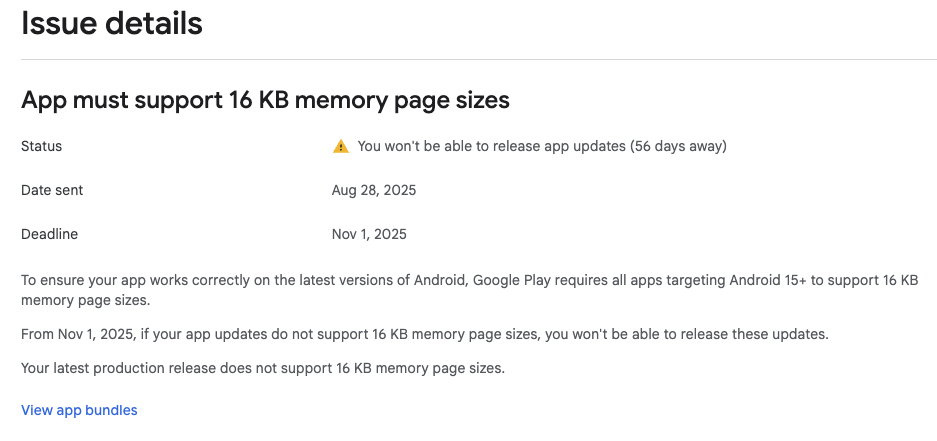
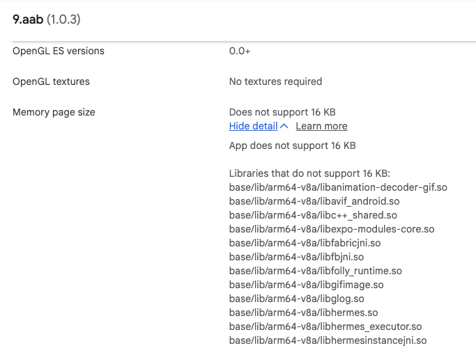

# Android 16KB page sizes support for Google Play Store

Starting **November 1st, 2025**, Google Play Store will require all new apps and app updates targeting Android 15+ (API level 35+) to support devices with 16KB memory page sizes.

You may have seen this warning from the Google Play Store:

[](./assets/android-16kb-page-sizes/google-play-store-warning.png)

This guide will walk through the problem and how to resolve it for Expo apps.

## Quick Summary

**✅ You're already ready if:**

- Using **Expo SDK 53+** with `expo@53.0.14` or newer
- Using **Expo SDK 54+** or **55+** (when available)

**⚠️ Action needed if:**

- Using **Expo SDK below 53**
- Using **Expo SDK 53** with `expo@<53.0.14`
- Have third-party libraries with native code that are incompatible with 16KB page size

**🗓️ Key deadlines for Google Play Store:**

- **August 31, 2025**: Must target Android 15+ (API level 35+)
- **November 1, 2025**: Must support 16KB page sizes
- **May 31, 2026**: Extended deadline if you request more time

**🚀 Quick fix:** Update to Expo SDK 53+ and run `npx expo install --fix`

## Android 16KB page sizes support

To support better performance in modern 64-bit devices, Google encourages apps to be compatible with 16KB page sizes.

Quotes from their [blog post](https://android-developers.googleblog.com/2025/05/prepare-play-apps-for-devices-with-16kb-page-size.html):

> We’ve seen that 16 KB can help with:
>
> - **Faster app launches:** See improvements ranging from 3% to 30% for various apps.
> - **Improved battery usage:** Experience an average gain of 4.5%.
> - **Quicker camera starts:** Launch the camera 4.5% to 6.6% faster.
> - **Speedier system boot-ups:** Boot Android devices approximately 8% faster.

Google Play Store has implemented a new policy that enforces all new updates to be ready for 16KB page size support.

> Starting November 1st, 2025, all new apps and updates to existing apps submitted to Google Play and targeting Android 15+ devices must support 16 KB page sizes on 64-bit devices.

Learn more from the [Google doc](https://developer.android.com/guide/practices/page-sizes) and the [blog post](https://android-developers.googleblog.com/2025/05/prepare-play-apps-for-devices-with-16kb-page-size.html).

## How to verify if my app is compatible with 16KB page size

### Verify uploaded app from Google Play Console

You can check your existing app bundle from the [app bundle explorer](https://play.google.com/console/developers/app/bundle-explorer-selector) in Play Console.

The explorer will show whether your app bundle is compatible and will also list incompatible files:

[](./assets/android-16kb-page-sizes/app-bundle-explorer.png)

### Verify from an APK file

If you are on Linux or macOS and have the Android SDK installed, according to the [doc](https://developer.android.com/guide/practices/page-sizes#16-kb-impact), you can use the [`check_elf_alignment.sh`](https://cs.android.com/android/platform/superproject/main/+/main:system/extras/tools/check_elf_alignment.sh) script, or download it from our [copy](./assets/android-16kb-page-sizes/check_elf_alignment.sh).

For incompatible APK:

```bash
$ bash check_elf_alignment.sh /path/to/your-app.apk
...
/var/folders/yw/6bx918xn4671rggfcdxz7fph0000gn/T/app-release_out_XXXXX.qBwMlQgVL7/lib/x86_64/libreactnative.so: UNALIGNED (2**12)
Found 76 unaligned libs (only arm64-v8a/x86_64 libs need to be aligned).
```

Or list only the unsupported libraries:

```bash
$ bash check_elf_alignment.sh /path/to/your-app.apk | grep -E '(arm64-v8a|x86_64).*UNALIGNED'
...
/var/folders/yw/6bx918xn4671rggfcdxz7fph0000gn/T/app-release_out_XXXXX.qBwMlQgVL7/lib/x86_64/libreactnative.so: UNALIGNED (2**12)
```

### What does it mean for unsupported libraries?

For unsupported libraries, they require the library authors to follow the [guide](https://developer.android.com/guide/practices/page-sizes#build) to build their libraries with 16KB page size support. These libraries may come from React Native, Expo, or third-party libraries you have added to your app.

For example, these are some known libraries and their sources:
| Library | Source |
|----------------------|------------------------------------------------------------------------|
| libreactnative.so | [react-native](https://github.com/facebook/react-native) |
| libhermes.so | [react-native](https://github.com/facebook/react-native) |
| libgesturehandler.so | [react-native-gesture-handler](https://github.com/software-mansion/react-native-gesture-handler) |
| libexpo-modules-core.so | [expo-modules-core](https://github.com/expo/expo/tree/main/packages/expo-modules-core) |
| libexpo-av.so | [expo-av](https://github.com/expo/expo/tree/main/packages/expo-av) |
| libexpo-gl.so | [expo-gl](https://github.com/expo/expo/tree/main/packages/expo-gl) |

## How to get my app to support 16KB page size

React Native supports 16KB page sizes since [version 0.77](https://reactnative.dev/blog/2025/01/21/version-0.77#android-version-15-support--16kb-page-support). You need to upgrade to an Expo SDK that includes React Native 0.77, which means Expo SDK 53.

We resolved Expo libraries to support 16KB page sizes in [expo#37446](https://github.com/expo/expo/pull/37446) and [expo#37454](https://github.com/expo/expo/pull/37454). We published the fixes in `expo@53.0.14`. Make sure you update to SDK 53 and run `npx expo install --fix` to get the latest Expo version.

> [!TIP]
> Update your app to Expo SDK 53 or newer. If you have Expo SDK 53 already, make sure to have `expo@53.0.14` by running `npx expo install --fix`.

### What if my app is already on the supported SDK versions, but my app is still not 16KB page sizes compatible?

If you are already on `expo@>=53.0.14` and your app is still incompatible with 16KB page sizes, this is probably coming from additional third-party libraries. You have to [identify the incompatible libraries](#how-to-verify-if-my-app-is-compatible-with-16kb-page-size) and send an issue report to the corresponding library author.

### Can I downgrade the `targetSdkVersion` to 34 or lower?

Though 16KB page size support is targeting Android 15+ (API level 35+), if your app has a lower `targetSdkVersion`, it is not affected. Unfortunately, Google Play Store has [another policy to enforce new updates with API level 35+ from August 31st, 2025](https://support.google.com/googleplay/android-developer/answer/11926878)

> Starting August 31 2025:
>
> New apps and app updates must target Android 15 (API level 35) or higher to be submitted to Google Play; except for Wear OS, Android Automotive OS, and Android TV apps, which must target Android 14 (API level 34) or higher.

Therefore, you cannot downgrade `targetSdkVersion` to bypass the 16KB page size policy. You still need to update your app to be compatible with 16KB page sizes.

## Need more time to upgrade Expo SDK?

If you have difficulty upgrading your Expo SDK or need more time to get ready for the 16KB page size support, Google Play Store offers an option to extend the timeline.

> If you need more time to update your app, you can request an extension to this deadline. If you request more time, you'll have until May 31, 2026 to update your app.
