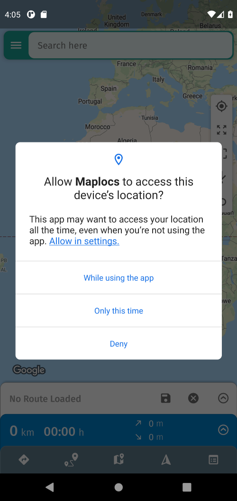
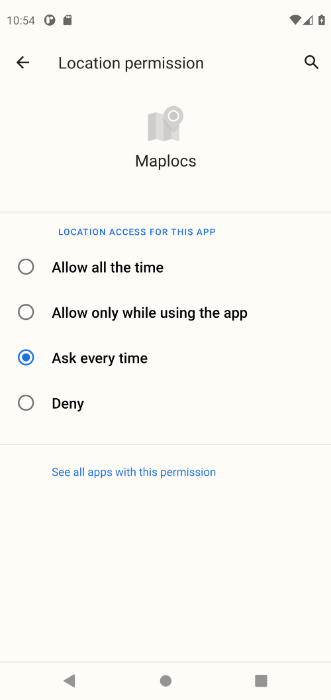
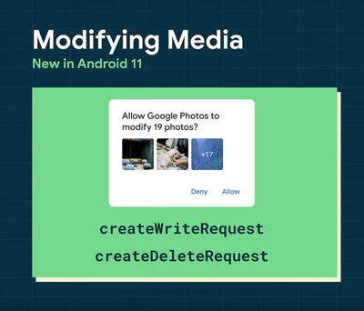
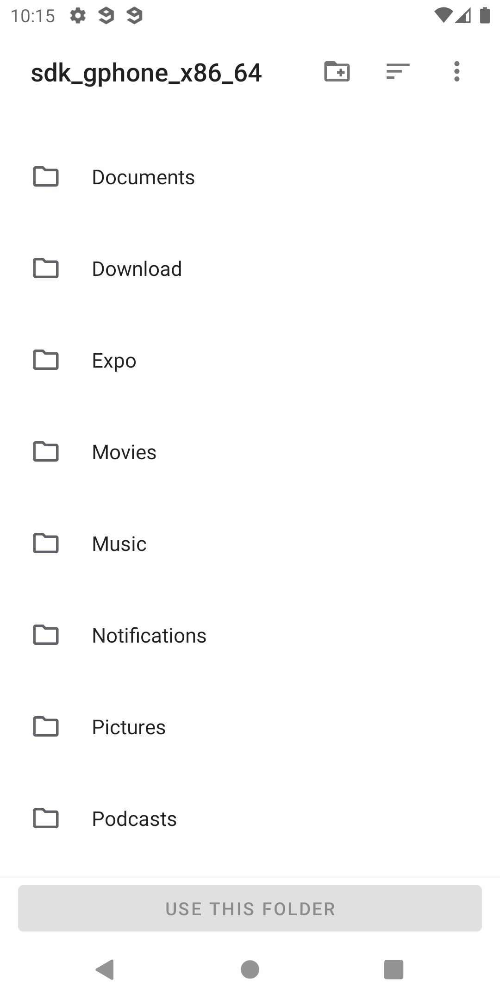

# What's new in Android R

### Does it concern me?

If you're using or want to update to **SDK 41** or **higher**, you should check if you're using expo-location or expo-media-library and follow the instructions below.

You may also observe in SDK <= 40 projects running the latest Play Store version of Expo Go that some functionality doesn't work as intended when using a device with Android R or higher. That's because we didn't backport changes required by the newest Android to the older SDKs. We didn't backport the changes because that would have broken existing applications on already-released SDKs and forced developers to change their code even when they didn't update the SDK version.
When you building your app using SDK <= 40 with the `expo build:android` service, everything should work as it used to. For development purposes, rather than using the Expo Go app from the Play Store you can install an older version of Expo Go by running `expo client:install:android` in your project directory.

## A new way of handling location permissions

To protect user privacy the Android team changed how an app requests access to location in the background. To address those changes in the Expo SDK, we split location permissions into `foreground` and `background`.

### The foreground permission

If your app contains a feature that shares or receives location information only once, or for a defined amount of time, then that feature requires foreground location access.

#### Requesting permission

When your application requests the foreground permission, users will see modal that looks like this:

#### Differences in the way it works across all Android versions

The flow for that permission is the same across all Android versions.

### The background permission

An app requires background location access if a feature within the app constantly shares location with other users or uses the Geofencing API.

#### Requesting permission

When your application requests the background permission, users won't see a modal — they will be redirected to the settings screen, which should look like this:

In order for the user to understand why they have been redirected to this screen, you should inform the user why your application requires background permissions.

**You can request the background permission only if the foreground permission was granted.**

#### Differences in the way it works across all Android versions

- On Android lower than Q, the background permission resolves to the foreground permission and the application won't redirect the user to the settings screen when asked.

- On Android Q, the background permission will display a similar system modal to the foreground permissions instead of redirecting to the settings screen.

> If you want to know more about location permissions on Android, please check out [this article](https://medium.com/@ty2/understanding-permissions-for-background-location-on-android-11-and-below-bc3ad9be320a).

## Scoped Storage

Scoped storage is another change that was made in the interest of protecting Android users. Rather than granting an app access to all public files on the device filesystem when it needs to write files, it can be given access to an app-specific scoped directory and pre-defined locations for files, images, etc, called Collections.

The scoped storage API was introduced in Android 10. Previously, we temporarily opted out of this feature by using `requestLegacyExternalStorage` flag, but this option is no longer available when you're targeting Android 11.

### What was changed?

Some of the media library functions will ask the user for permissions before they perform any actions. You should be prepared that any of those functions may be rejected when the user doesn't grant the required permissions.

If your app created an album using SDK <= 40 and you want to add more assets to this album, you need to migrate it to the new scoped directory. Otherwise, your app won't have access to the old album directory and expo-media-library won't be able to add new assets to it. However, all other functions will work without problems. You only need to migrate the old album if you want to add something to it.

### Album migration

To make the migration as easy as possible, we introduced two new functions into the media library:

- `albumNeedsMigrationAsync` which checks if the album should be migrated. In other words, it will check that new media can be added to the library — if not, then the album needs to be migrated.
- `migrateAlbumIfNeededAsync` which tries to migrate your album automatically to the new directory.

Unfortunately, it not always possible to migrate automatically. For example, if the album contains incompatible file types, the migration method will be rejected, because the media library couldn't figure out where files should be saved. This can happen if you stored mixed file types like music and photos in the same album.

**Remember to migrate only those albums which were created by your app!**

### Incompatible file types:

- music and pictures or movies
- documents and music, pictures or movies
- not multimedia types

> Note: **movies** and **pictures** are compatible with each other.

### What about newly created albums?

From now (SDK >= 41), all new albums will be saved into directories compatible with the scoped storage. If you're not sure if the album should be migrated or not, use `albumNeedsMigrationAsync` from media library.

### What can I do if the migration failed?

If `migrateAlbumIfNeededAsync` doesn't meet your needs, you can always try to migrate files manually. To do this, you can use new method from the file system module - `askForDirectoryPermissionsAsync`. This function allows users to select a specific directory, granting your app access to all of the files and sub-directories within that directory.

After the user selects the folder, you will receive a URI that is compatible with the Scoped Storage Framework (SAF). Your application will have read and write permissions for that directory. However, the SAF URI can't be treated as other URIs which can be found on Android. **It's impossible to use expo-media-library directly with SAF URI.** Therefore, you need to manually copy or move files from the external album directory into internal storage with expo-file-system. Then using expo-media-library, you can create a new album or do whatever you want.

**You should use manual migration only if this is necessary. We believe that for most cases, automatic migration is enough.**

> **Note**: The user can select any folder on his phone (Android doesn't give the option to lock the system model on any directory), so you need to be prepared for a situation where the application won't have access to the wanted folder.

> If you want to know more about scoped storage on Android, please check out the [documentation](https://developer.android.com/about/versions/11/privacy/storage).

> To get more information about the new API, check out [expo-media-library](https://docs.expo.io/versions/latest/sdk/media-library/) and [expo-file-system](https://docs.expo.io/versions/latest/sdk/filesystem/) documentation.

## MAC Address

Beginning with Android R, non-system applications no longer have access to the device's MAC address.

Your standalone apps built with SDK 40 or below will continue to work as before on older Android operating systems. On Android R, the `getMacAddressAsync` method will always return a dummy value of `'02:00:00:00:00:00'`.

In Expo Go 2.19.x, the `getMacAddressAsync` method will always return `'02:00:00:00:00:00'` in **all supported SDK versions**. This will also be the behavior in SDK 41+ standalone apps.

The `getMacAddressAsync` method has been deprecated as of SDK 41 and will be removed in a future release. To uniquely identify a device, we recommend using the methods/values found in `expo-application`.
