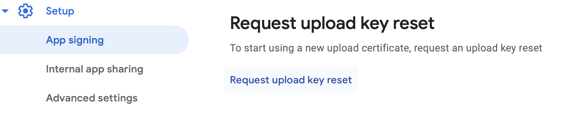

# Reseting your Android Upload key
## Background
[Google Play App Signing](https://support.google.com/googleplay/android-developer/answer/9842756?hl=en) is a security service where Google manages the app signing key on behalf of you as a developer.  All newer apps (and many others) that are live on the Play Store are opted into Play App Signing. 

With Play App Signing, Google maintains the signing key used to verify that your app is authentic. Meanwhile, when your app is built, it is signed with a separate "Upload key". Google Play checks your upload key when you are going to publish your app to ensure the app binary is from you. If you lose this key, as long as you still have access to your Play Store account, you can reset it and continue publishing your app.

## Reset your key with EAS-managed credentials
Google provides the most up-to-date information how to reset your key in their [Play Console Help section on Play App Signing](https://support.google.com/googleplay/android-developer/answer/9842756?visit_id=637973748658459850-3395295471&rd=1#reset), so be sure to consult that if you have any questions. However, if you use EAS to manage your Android app credentials, the process is generally a little easier, because the EAS CLI can create the new upload keystore for you.

### Generate a new Upload keystore
1. Run `eas credentials`.
2. Choose "Android".
3. Choose the correct build profile, generally your "production" build profile.
4. Choose the "Keystore" option.
5. Chose the option to your keystore.
6. Now choose the option to create a new keystore.
7. Finally, choose the option to download your new keystore. This will display fingerprint info for your keystore and download a **.jks** file.

### Reset your upload key on the Play Store
These directions can change at Google's discretion, so always best to check [their latest instructions](https://support.google.com/googleplay/android-developer/answer/9842756?visit_id=637973748658459850-3395295471&rd=1#reset). As of November 2023, you can reset your upload key via an option under your app in the Play Store Console:
