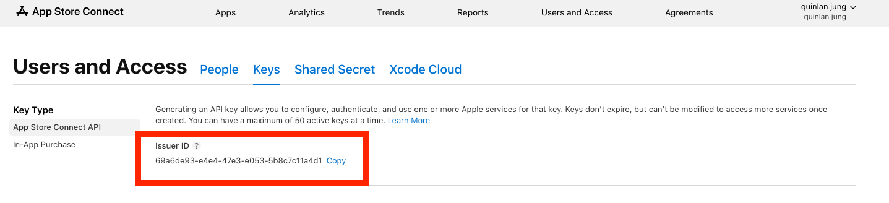

# Finding your App Store Connect Issuer ID

An Issuer ID identifies the issuer who created the authentication token in App Store Connect. This page will guide you through the process of finding your Issuer ID.

1. Open the [App Store Connect Portal](https://appstoreconnect.apple.com/access/users) and go to the **Keys** tab under the Users and Access section.

2. Your Issuer ID can be found in the red box in the picture below:

