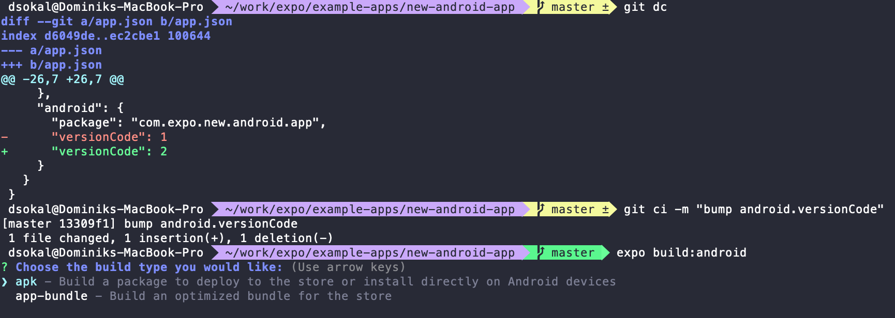
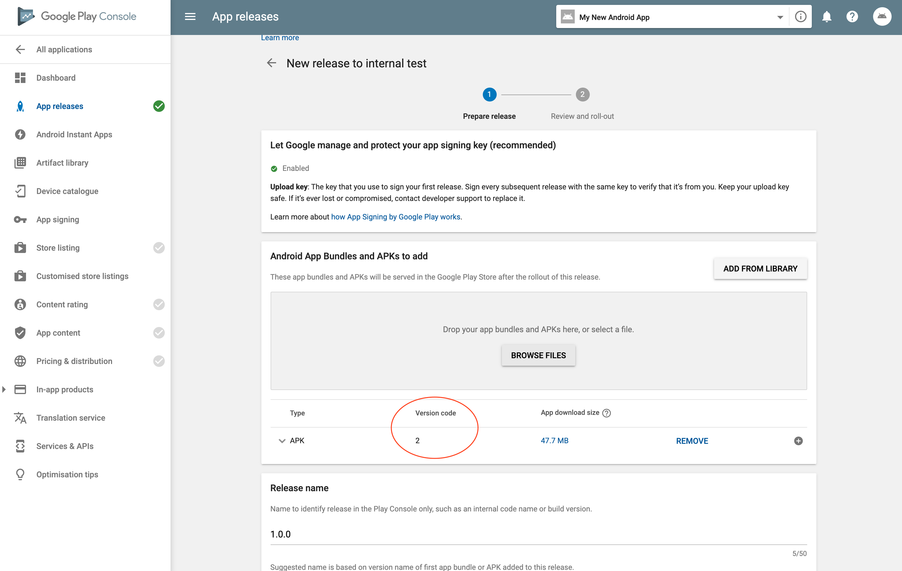

# Bumping Android Version Code

#### 🤔 What Happened

If you're submitting your Android app to Google Play Store using the `expo upload:android` command, you may encounter the error saying you've already submitted a particular version of the app.

#### 💡 Solution

1. Increment the value for the `expo.android.versionCode` key in `app.json`. Optionally, commit this change. Then, build a new app archive with `expo build:android`. Wait for the build to finish.

2. Run `expo upload:android --use-submission-service` to upload your app to Google Play Store. Wait for the submission to complete.

3. You can verify that the app has been submitted by visiting [Google Play Console](https://play.google.com/apps/publish/).

