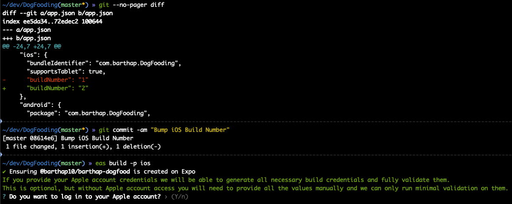
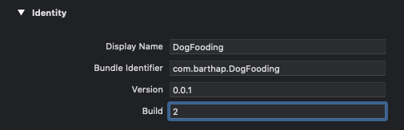
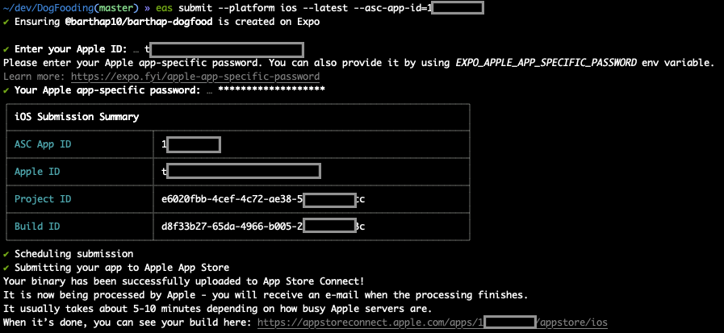
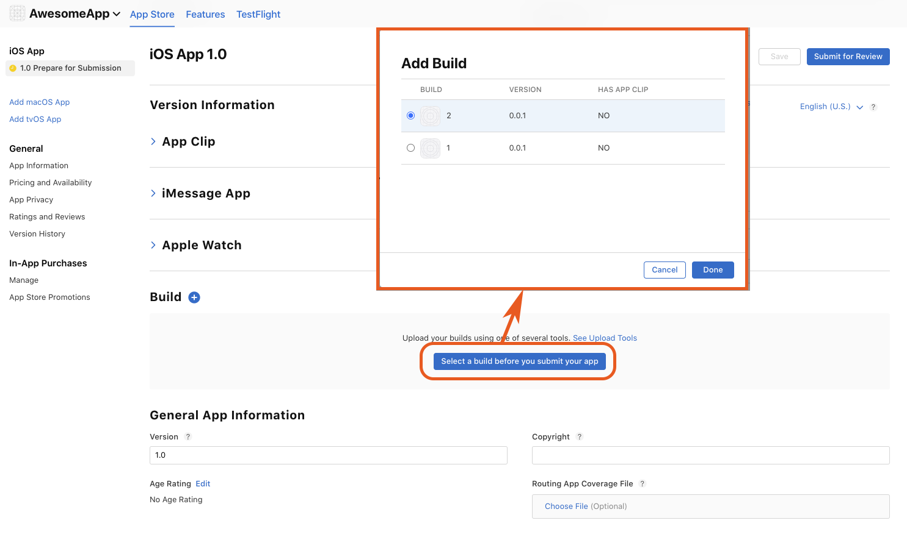

# Bumping iOS Build Number

#### 🤔 What Happened

If you're submitting your iOS app to App Store using the `eas submit` command, you may encounter the error saying you've already submitted a particular version of the app.

#### 💡 Solution

1. - **If you are building a managed Expo app**

     Increment the value for the `expo.ios.buildNumber` key in `app.json`. This can be done manually or [automatically with app version management](https://docs.expo.dev/build-reference/app-versions/). Remember that this value must be a string. Optionally, commit this change. Then, build a new app archive with `eas build`. Wait for the build to finish.

     

   - **If you are building a bare React Native app**

     In Xcode, enter your project settings (left click on project name) and increase the _Build_ value under _General -> Identity_ section.

     

2. Run `eas submit --platform ios` to upload your app to App Store. Wait for the submission to complete.

3. Wait for Apple to process your build. This may take about 5-10 minutes, depending on how busy Apple servers are. Then you can verify that the app has been submitted by visiting [App Store Connect](https://appstoreconnect.apple.com/apps).

