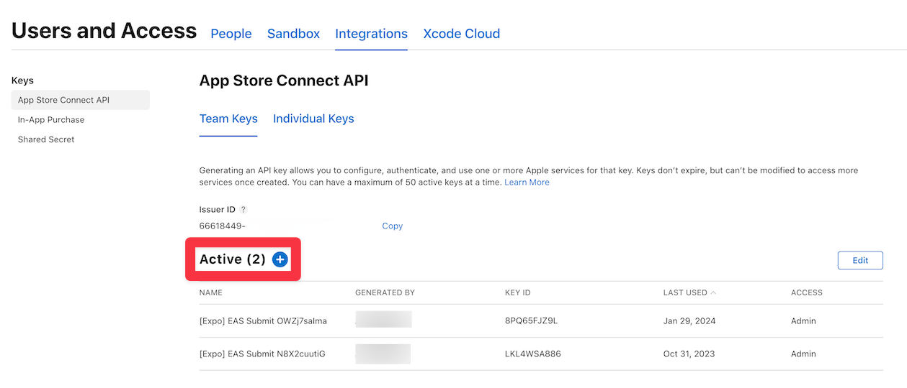
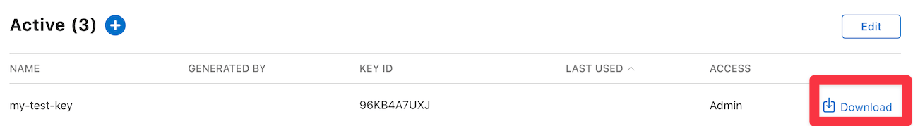
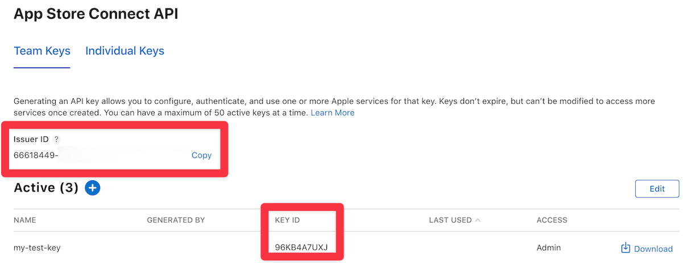

# Creating an App Store Connect Api Key

If you’d like to submit your iOS app to the Apple App Store with `eas submit`, you need an App Store Connect Api key **or** an App Specific Password. This page will guide you through the process of creating an App Store Connect Api key.

1. Open the [App Store Connect Portal](https://appstoreconnect.apple.com/access/users) and go to the **Keys** tab under the Users and Access section.

2. Press the **big plus button** beside the Active header.

3. Give your key a name and an `Admin` level role.

4. Click the **Download API Key** button to download the .p8 file.

5. You'll also need to provide the following information to the submission service:

- Key ID
- Issuer ID

These can be found in the red boxes in the picture below:

6. That's all! From now on, you can use the generated App Store Api key to submit your app with `eas submit`.
