# Creating Google Service Account

If you’d like to submit your Android app to Google Play Store with `expo upload:android` or `eas submit` you need to create a Google Service Account key. This page will guide you through this process.

1. Open [Google Play Console](https://play.google.com/apps/publish/) and go to the **Settings** tab.

[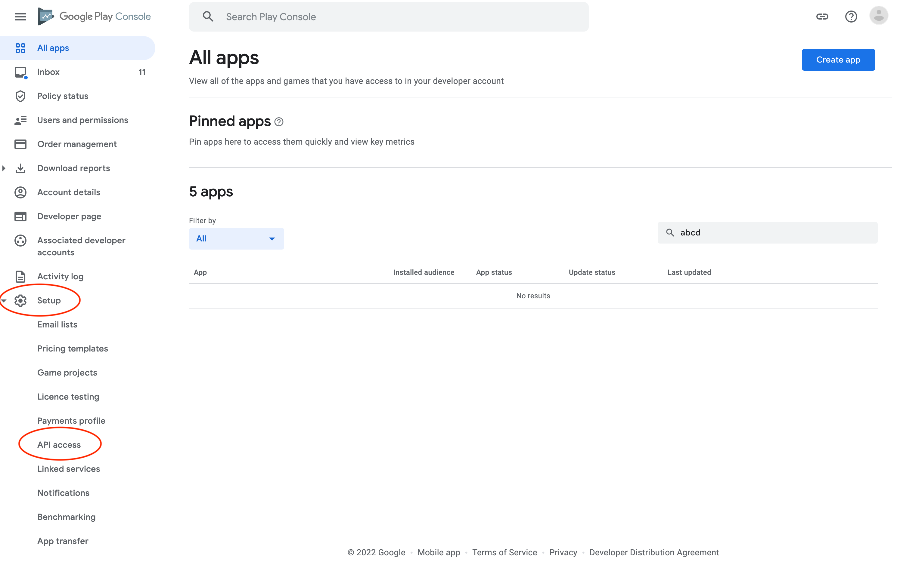](./assets/creating-google-service-account/01-open-google-play-console.png)

2. Choose **API access** from the sidebar. If you see a message saying API access is not enabled for your account, you must first link your Google Play developer account with a Google Developer Project. On this page, select **Choose a project to link**, then either link it to an existing project if you have one, or select **Create new project** and then click **Link project**.

[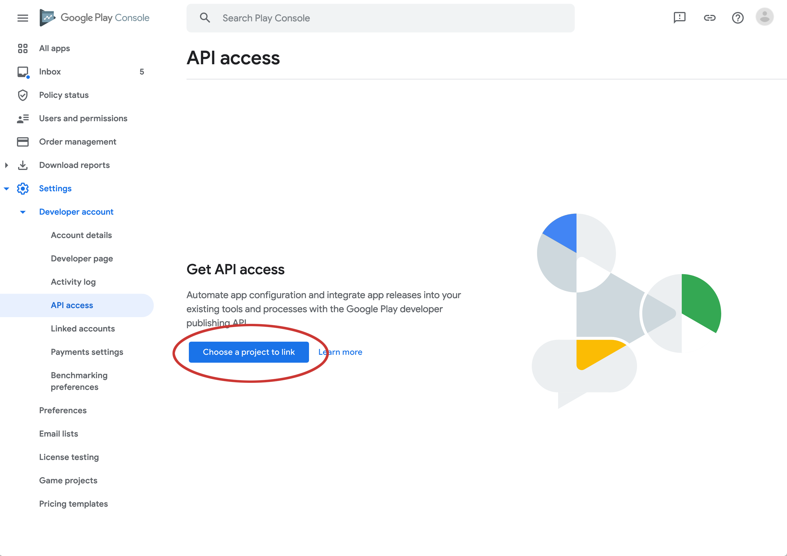](./assets/creating-google-service-account/02-api-access.png)

[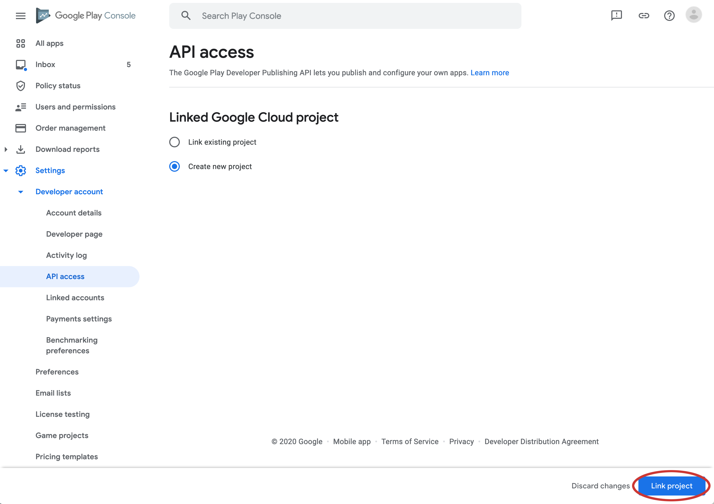](./assets/creating-google-service-account/03-create-new-project.png)

3. Click **create new service account** and follow the **Google Cloud Platform** link in the dialog.

[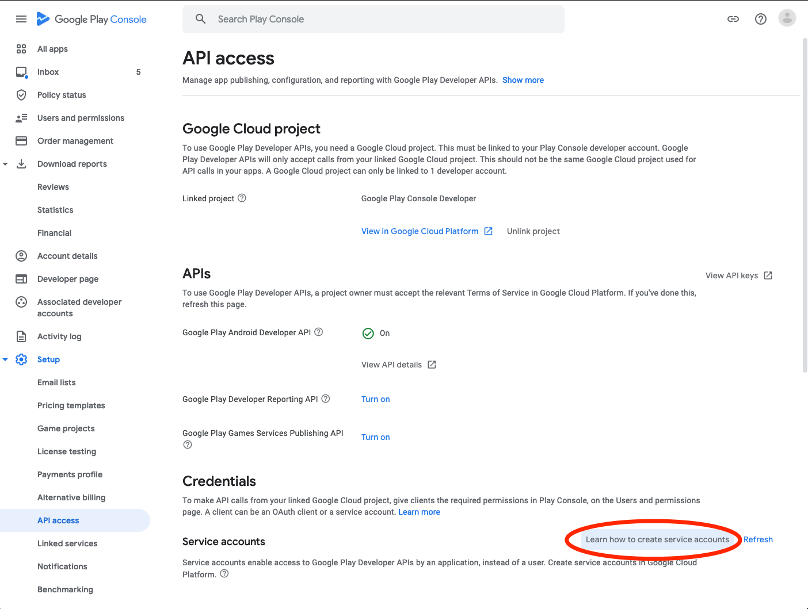](./assets/creating-google-service-account/04-create-new-service-account.png)

[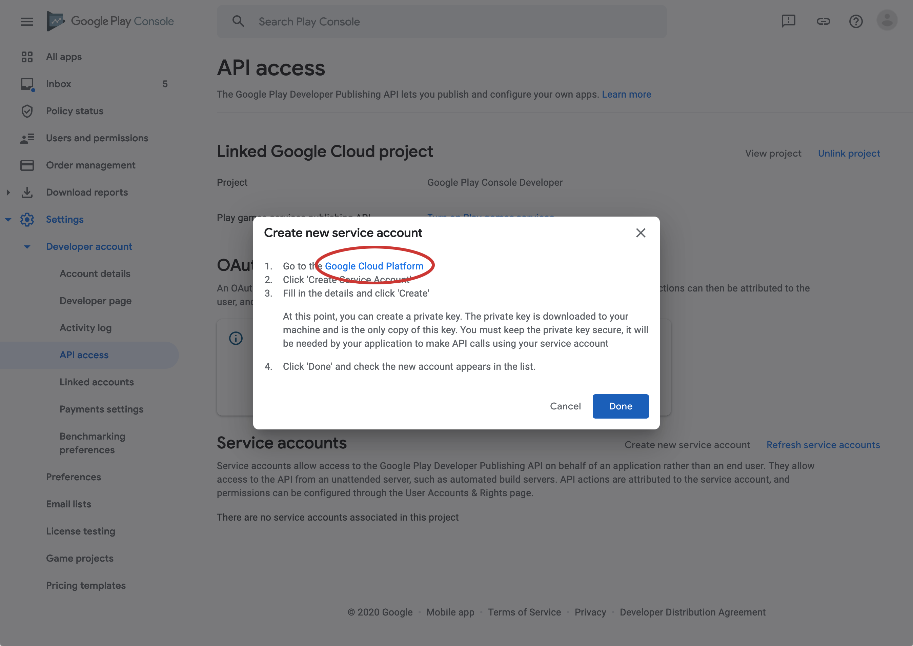](./assets/creating-google-service-account/05-service-account-dialog.png)

4. Click another **CREATE SERVICE ACCOUNT** button.

[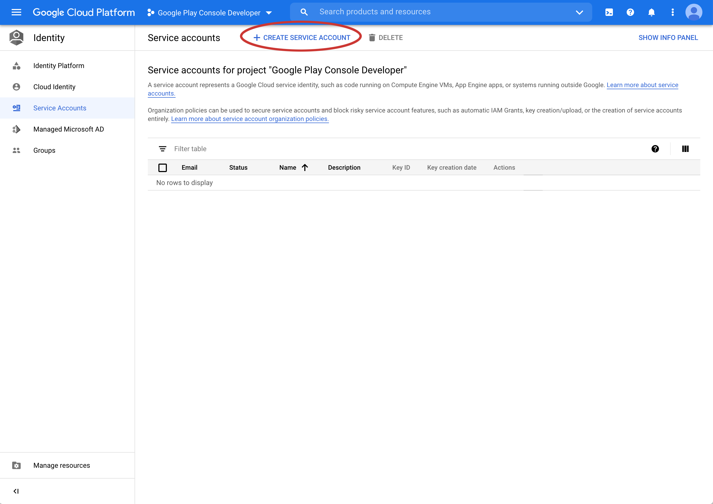](./assets/creating-google-service-account/06-google-cloud-platform.png)

5. Enter the name of this service account in the field titled "Service account name". We recommend a name that will make it easy for you to remember that it is for your Google Play Console account. Also, enter the service account ID and description of your choice. Click the **CREATE** button.

[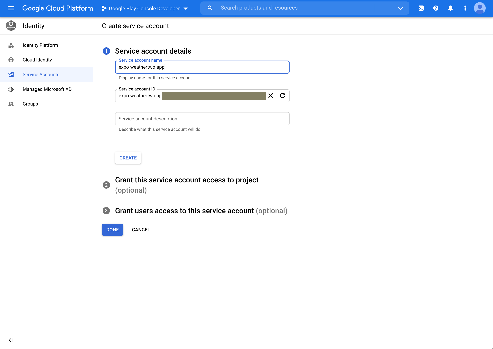](./assets/creating-google-service-account/07-service-account-name.png)

6. Click **Select a role** and choose **Service Accounts > Service Account User**. Click **DONE**.

[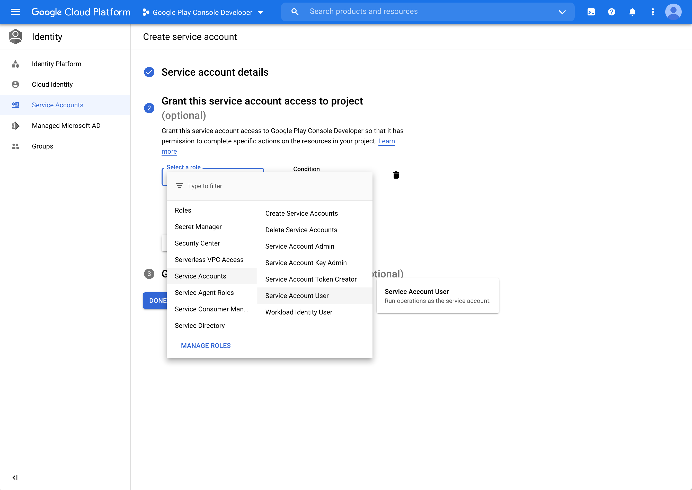](./assets/creating-google-service-account/08-service-account-permissions.png)

7. Select **Create key** from the options button for your newly created Service Account. Choose **JSON** and then the **CREATE** button. Download the `.json` file and store it in a safe place.

[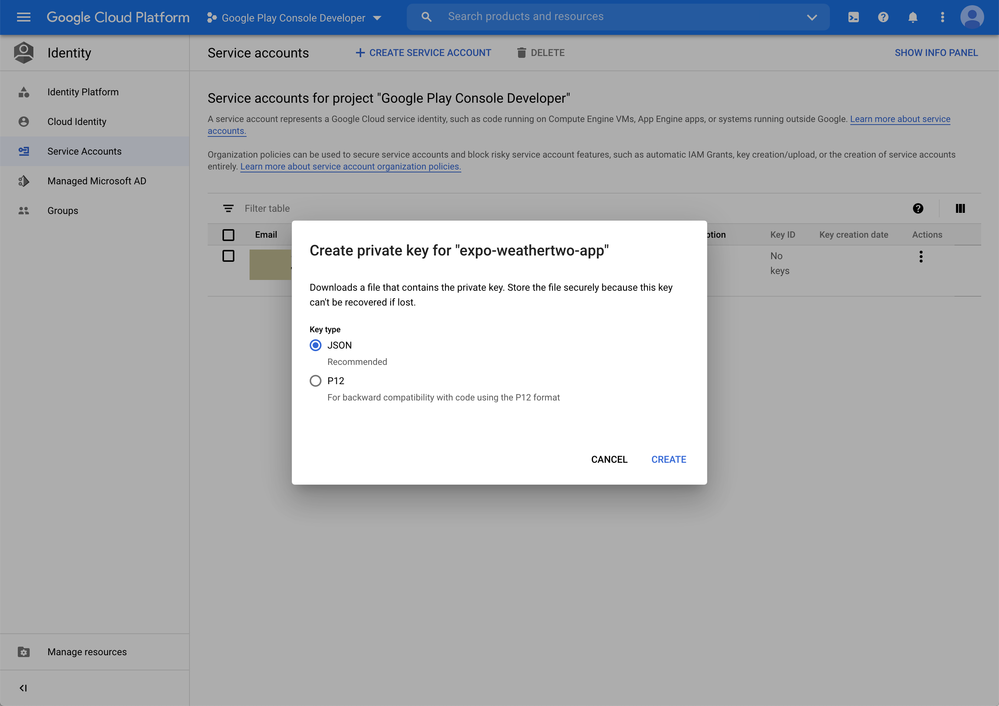](./assets/creating-google-service-account/10-create-json-key.png)

8. Return to the **API access page** on the Google Play Console and ensure it shows your new service account. Click on **Grant access** for the newly added service account.

[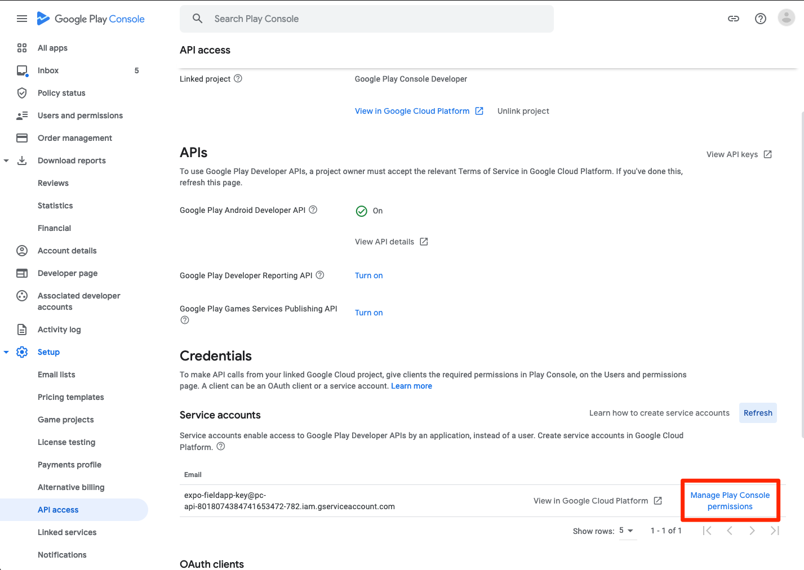](./assets/creating-google-service-account/11-grant-access.png)

9. Click **Invite user**.

[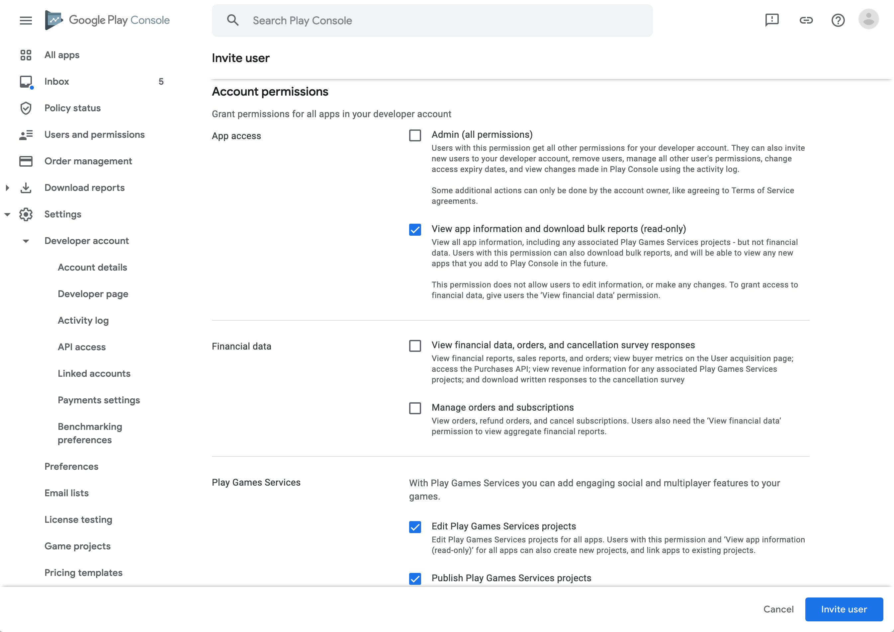](./assets/creating-google-service-account/12-invite-user.png)

10. That's all! From now on, you can use the generated Google Service Account to upload your app with `expo upload:android` or `eas submit`.
