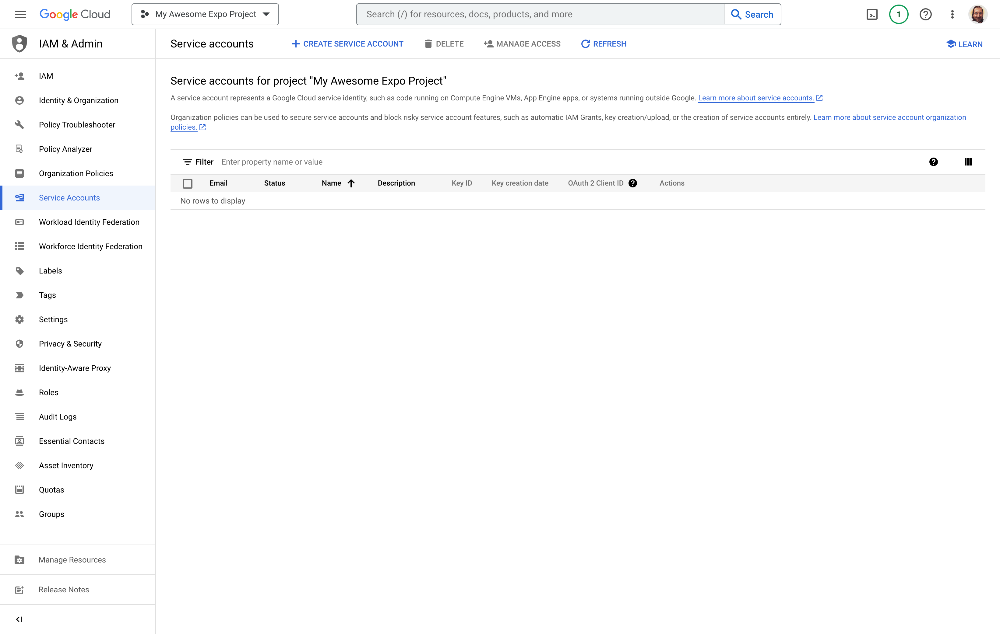
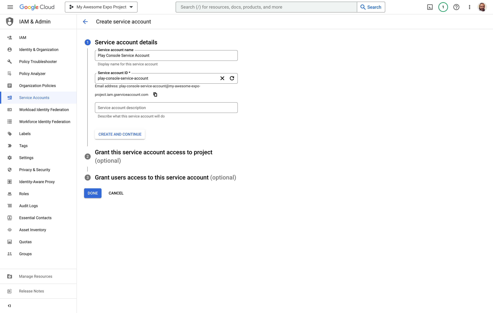
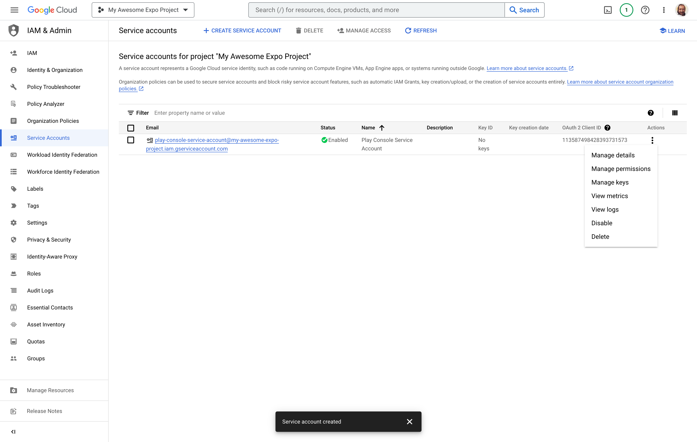
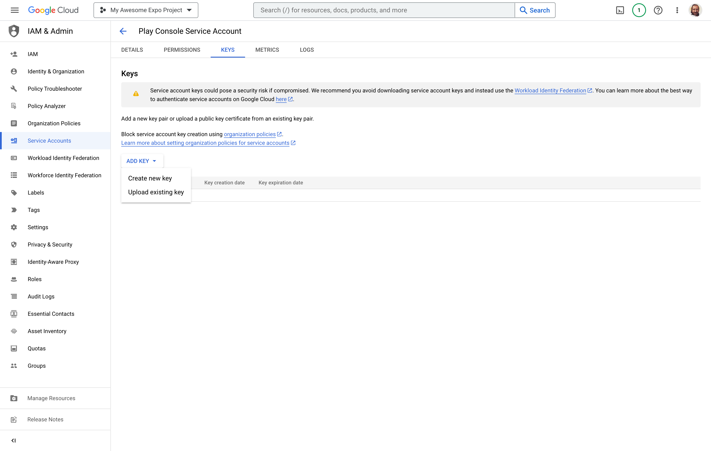
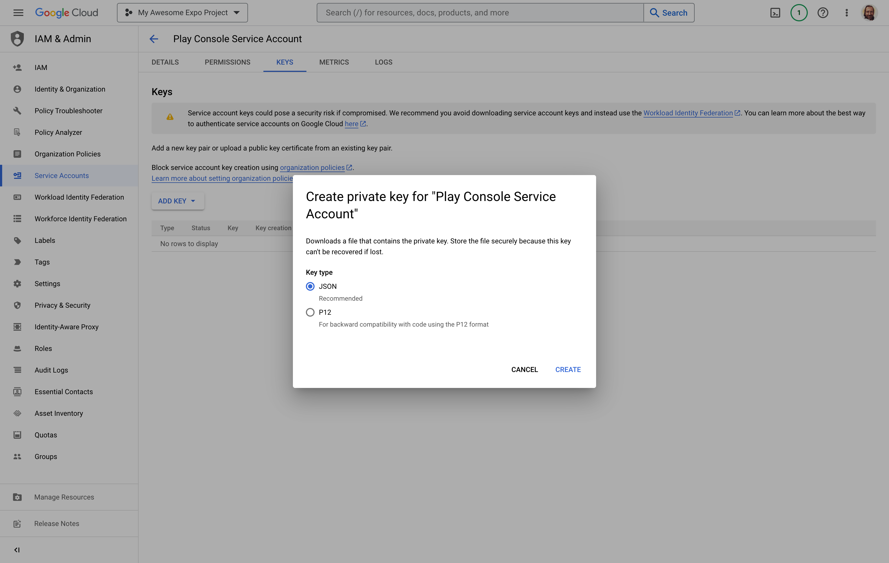
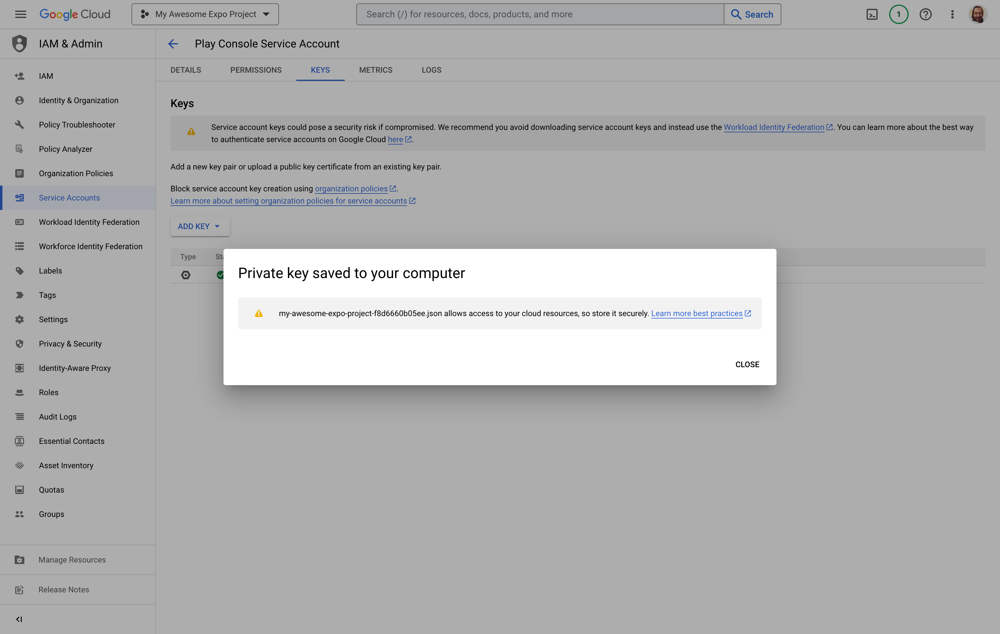
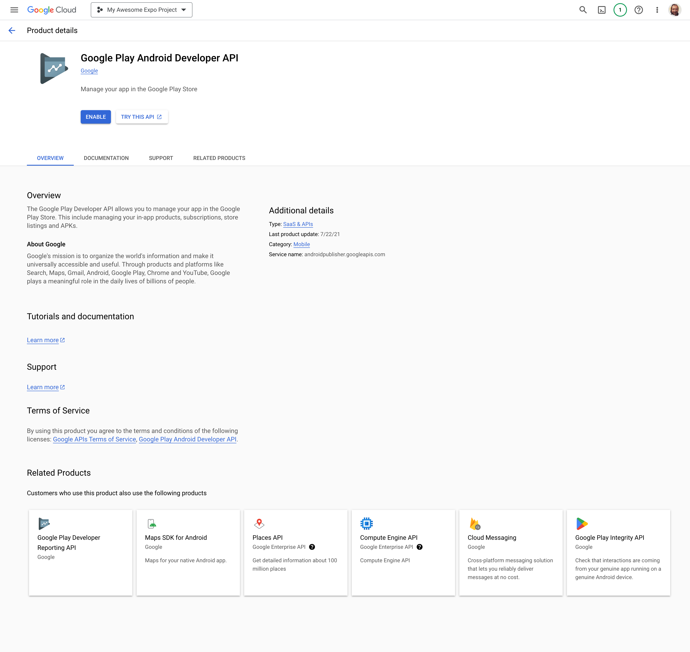
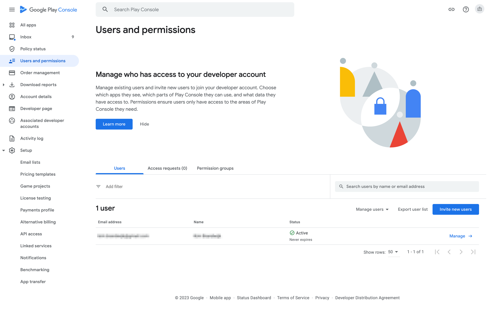
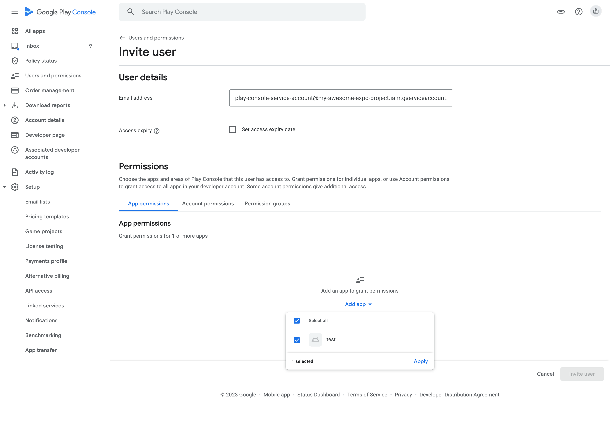
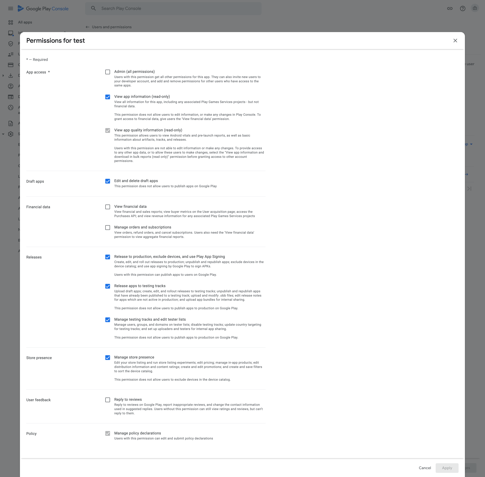

# Uploading a Google Service Account Key for Play Store Submissions with EAS

A Google Service Account Key is a credential in the form of a JSON file that you can obtain via Google Cloud for a particular Google Service Account.

EAS requires a Google Service Account Key to be uploaded and configured for submitting your Android app to the Google Play Store with `eas submit`.

> [!NOTE]
> Beginning in June 2024, all Android notifications must be sent using the FCM v1 protocol. EAS requires a Google Service Account Key to be uploaded and configured for sending Android push notifications via `https://exp.host/--/api/v2/push/send` using the FCM v1 protocol. You can configure separate Google Service Account Keys for Play Store Submissions and [sending Android Push notifications with FCM v1 protocol](https://docs.expo.dev/push-notifications/fcm-credentials/) or you can upload a single Google Service Account Key and use it for both use cases (provided that the correct authorizations are in place for that Service Account in Google Cloud Console).

To set up a Google Service Account Key for Play Store Submissions via `eas submit`, the following steps are required:

- Create a Google Cloud project (optional if you already have one)
- Create a Google Service Account and create and download the JSON key file
- Enable the Google Play Android Developer API
- Invite the Google Service Account to your Google Play Console account

1. If you don't have a Google Cloud project yet, create one in the [Google Cloud Console](https://console.cloud.google.com/projectcreate). If you already have a project, you can skip this step.

2. Open the [Service Accounts page](https://console.cloud.google.com/iam-admin/serviceaccounts) in the Google Cloud Console and click **CREATE SERVICE ACCOUNT**.

3. Enter a name for your service account. We recommend a name that will make it easy for you to remember that it is for your Google Play Console account. Optionally, enter the service account ID and description of your choice. Click the **DONE** button.

4. On the newly created service account, select **Manage keys** from the options button, then **Create new key**. Choose **JSON** and then the **CREATE** button. Download the `.json` file and store it in a safe place.

5. Open the [Google Play Android Developer API](https://console.cloud.google.com/apis/library/androidpublisher.googleapis.com) page and click **ENABLE**.

6. In the Google Play Console, open the [Users & permissions](https://play.google.com/console/users-and-permissions) page and click **Invite new users**.

7. Enter the email address of the service account you created in step 3. On the **App permissions** tab, select your app(s). If you want to apply the permissions to all apps, you can also select the permissions on the **Account permissions** tab instead

8. Select the required permissions to upload and manage your app, and click **Invite user**

9. That's all! From now on, you can use the generated Google Service Account key to upload your app with `eas submit`.
