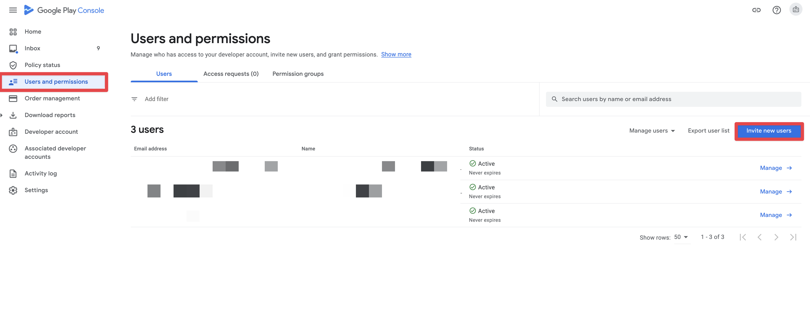

# Using a Google Service Account Key with EAS

A Google Service Account Key is a credential in the form of a JSON file that you can obtain via Google Cloud for a particular Google Service Account. 

EAS requires a Google Service Account Key to be uploaded and configured for the following use cases:

1. Submitting your Android app to Google Play Store with `eas submit`
2. Sending Android push notifications via `https://exp.host/--/api/v2/push/send` using the FCM v1 protocol

> **Note:** Beginning in June 2024, all Android notifications must be sent using the FCM v1 protocol.

You can configure separate Google Service Account Keys for each of these use cases, or upload a single Google Service Account Key and use it for both use cases (provided that the correct authorizations are in place for that Service Account in Google Cloud Console). 

The steps for each use case are detailed below.

 ## Uploading a Google Service Account Key for Play Store Submissions
 
 To set up a Google Service Account Key for Play Store Submissions via `eas submit`, the following steps are required:

- Create a Google Cloud project (optional if you already have one)
- Create a Google Service Account and create and download the JSON key file
- Enable the Google Play Android Developer API
- Invite the Google Service Account to your Google Play Console account

1. If you don't have a Google Cloud project yet, create one in the [Google Cloud Console](https://console.cloud.google.com/projectcreate). If you already have a project, you can skip this step.

2. Open the [Service Accounts page](https://console.cloud.google.com/iam-admin/serviceaccounts) in the Google Cloud Console and click **CREATE SERVICE ACCOUNT**.

3. Enter a name for your service account. We recommend a name that will make it easy for you to remember that it is for your Google Play Console account. Optionally, enter the service account ID and description of your choice. Click the **DONE** button.

4. On the newly created service account, select **Manage keys** from the options button, then **Create new key**. Choose **JSON** and then the **CREATE** button. Download the `.json` file and store it in a safe place.

5. Open the [Google Play Android Developer API](https://console.cloud.google.com/apis/library/androidpublisher.googleapis.com) page and click **ENABLE**.

6. In the Google Play Console, open the [Users & permissions](https://play.google.com/console/users-and-permissions) page and click **Invite new users**.

7. Enter the email address of the service account you created in step 3. On the **App permissions** tab, select your app(s). If you want to apply the permissions to all apps, you can also select the permissions on the **Account permissions** tab instead

8. Select the required permissions to upload and manage your app, and click **Invite user**

9. That's all! From now on, you can use the generated Google Service Account key to upload your app with `eas submit`.

## Using a Google Service Account Key for Sending Android Notifications via FCM v1
 
Here are the steps to set up a Google Service Account Key for sending Android Notifications via FCM v1.

### Configuring a new Google Service Account Key for Android Notifications using FCM v1

Here are the steps to configure a new Google Service Account Key in EAS for sending Android Notifications using FCM v1.

1. (If you already have a Firebase project for your app, continue to the next step.) Create a new Firebase project for your app in the [Firebase Console](https://console.firebase.google.com)

2. In the Firebase console, open Settings > [Service Accounts](https://console.firebase.google.com/project/_/settings/serviceaccounts/adminsdk) for your project

3. Click **Generate New Private Key**, then confirm by clicking **Generate Key**. Securely store the JSON file containing the private key.

4. Upload the JSON file to EAS and configure it for sending Android notifications. This can be done in EAS CLI or via [expo.dev](https://expo.dev).
  - using EAS CLI: run `eas credentials` → choose `Android` → choose `production` → choose `Google Service Accounts` → choose `FCM v1`
  - using [expo.dev](https://expo.dev): navigate to the [credentials page](https://expo.dev/accounts/[account]/projects/[project]/credentials) for your project → click on the Android application ID → find the section entitled "FCM v1 service account key" → click **Add a service account key** → upload your JSON credential and click **Save**

5. You're all set! You can now send notifications to Android devices via the Expo push notification service using the FCM v1 protocol.

### Using an existing Google Service Account Key to Send Android Notifications using FCM v1

1. Open the [IAM Admin page](https://console.cloud.google.com/iam-admin/iam?authuser=0) in Google Cloud Console. In the Permissions tab, locate the Principal you intend to modify and click the pencil icon for **Edit Principal**.

2. Click **Add Role** and select the `Firebase Messaging API Admin` role from the dropdown. Click **Save**.

3. Tell EAS which JSON credential file to use for sending FCM v1 notifications, either via EAS CLI or the [expo.dev](https://expo.dev) website. You can upload a new JSON file or select a previously uploaded file.
  - using EAS CLI: run `eas credentials` → choose `Android` → choose `production` → choose `Google Service Accounts` → choose `FCM v1`
  - using [expo.dev](https://expo.dev): navigate to the [credentials page](https://expo.dev/accounts/[account]/projects/[project]/credentials) for your project → click on the Android application ID → find the section entitled "FCM v1 service account key" → click **Add a service account key** → upload your JSON credential and click **Save**

4. You're all set! You can now send notifications to Android devices via the Expo push notification service using the FCM v1 protocol.

