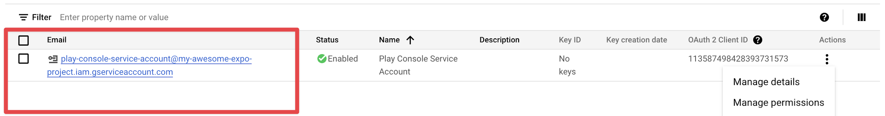
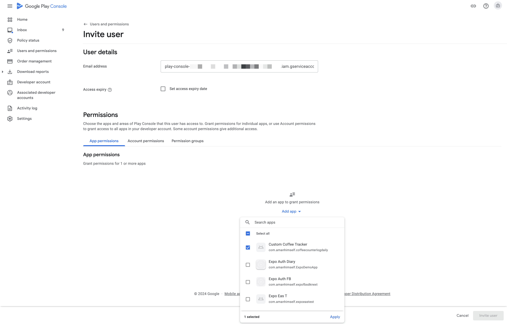

# Uploading a Google Service Account Key for Play Store Submissions with EAS

A Google Service Account Key is a credential in the form of a JSON file that you can get via Google Cloud for a particular Google Service Account.

**EAS requires you to upload and configure a Google Service Account Key** to submit your Android app to the Google Play Store with `eas submit`.

> [!NOTE]
> Beginning in June 2024, all Android notifications must be sent using the FCM v1 protocol. EAS requires a Google Service Account Key to be uploaded and configured for sending Android push notifications via `https://exp.host/--/api/v2/push/send` using the FCM v1 protocol. You can configure separate Google Service Account Keys for Play Store Submissions and [sending Android Push notifications with FCM v1 protocol](https://docs.expo.dev/push-notifications/fcm-credentials/) or you can upload a single Google Service Account Key and use it for both use cases (provided that the correct authorizations are in place for that Service Account in Google Cloud Console).

## Setup Service Account Key

To set up a Google Service Account Key for Play Store Submissions via `eas submit`, the following steps are required:

- Create a Google Cloud project (optional if you already have one)
- Create a Google Service Account and create and download the JSON key file
- Enable the Google Play Android Developer API
- Invite the Google Service Account to your Google Play Console account

1. If you don't have a Google Cloud project yet, create one in the [Google Cloud Console](https://console.cloud.google.com/projectcreate). If you already have a project, skip this step.

2. Open [**Service Accounts**](https://console.cloud.google.com/iam-admin/serviceaccounts) in the Google Cloud Console and click **Create Service Account**.

3. Enter a name for your service account. We recommend a name that will make it easy for you to remember that it is for your Google Play Console account. Optionally, enter the service account ID and description of your choice. Click the **Done** button.

4. From **Service Accounts**, copy the email ID for your account. You will need this in _step 8_.

5. Select **Manage keys** from the options button, then **Create new key**. Choose **JSON** and then click **Create**. Download the **.json** file and store it in a safe place.

6. Open the [Google Play Android Developer API](https://console.cloud.google.com/apis/library/androidpublisher.googleapis.com) and click **Enable**.

7. In the Google Play Console, open the [**Users and permissions**](https://play.google.com/console/users-and-permissions) and click **Invite new users**.

8. Enter the email address of the service account you created in _step 4_. On the **App permissions** tab, select your app(s). If you want to apply the permissions to all apps, you can also select the permissions on the **Account permissions** tab instead.

9. Select the following required permissions to upload and manage your app, and click **Invite user**.

10. Now you can upload your newly created Google Service Account Key to EAS servers and upload your app's release archive to Google Play Store using `eas submit`.

### Further reading

To learn more about how to use `eas submit` to create an internal test or a production release archive, or automate subsequent releases to Google Play Store with `--auto-submit` flag, see [Android Production build](https://docs.expo.dev/tutorial/eas/android-production-build/) chapter in the EAS Tutorial.
