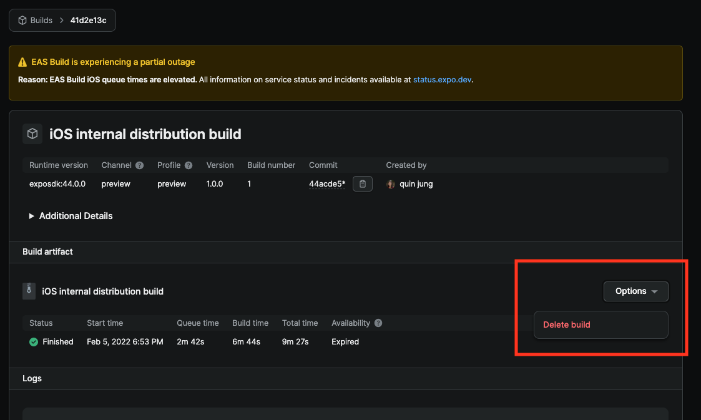

# Deleting a build

This document describes how to delete your EAS Build from Expo's servers.

1. Go to the [EAS Build](https://expo.dev/builds) page and select the build you want to delete.
2. Navigate to the **Build Artifact** section and click the **Options** button.
3. Select **Delete build** from the dropdown menu.
   
