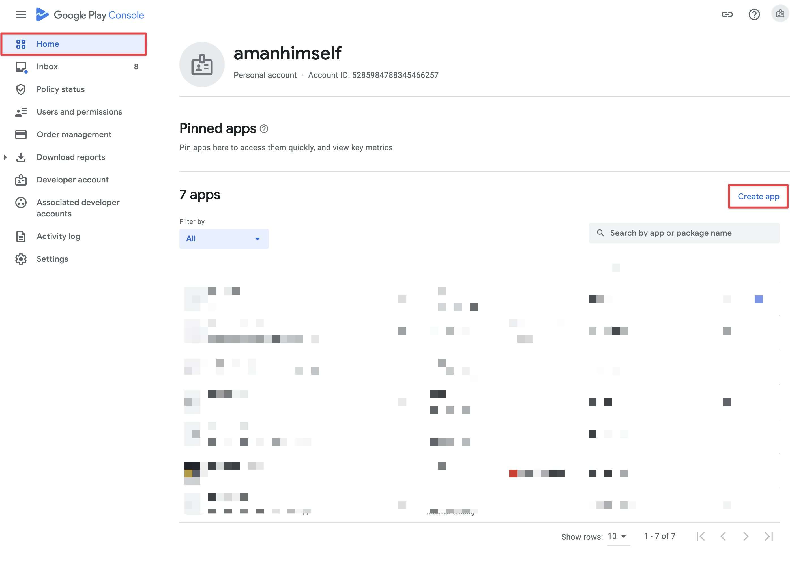
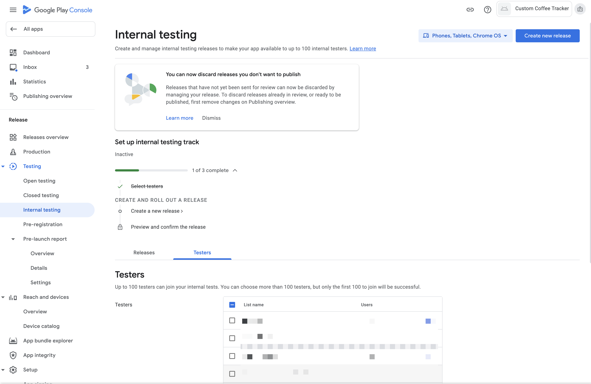

# First Submission of an Android App

#### 🤔 What Happened

If you're submitting your Android app to Google Play Store **for the first time**, Google requires that you manually upload it through their web user interface. After you have submitted it once through the web user interface, you will be able to use `eas submit -p android` for subsequent submissions.

#### 💡 Solution

This page will guide you through creating an app in Google Play Console and uploading the first release.

1. Open [Google Play Console](https://play.google.com/apps/publish/).

2. Click the **Create app** button.
3. Select **Default language**, **App or game**, **Free or paid**, fill in the **App name** input and click **Create app**.

4. You'll be redirected to a new page **Dashboard** where you need to fill all information about your application. **You don't need to set them now, come back and do this later.**

5. You'll need to go through all steps to fill the application details
>Note: This step is important otherwise, you will have some errors related to the application information when you want to publish your application.

5. Go to the **Testing** tab and scroll to the **Internal test track** section and click on it.

6. Click the **Create new release** button.

7. Opt in to app signing by Google Play. Although it's not necessary, this will let you upload your app if you somehow happen to lose your Android Keystore. Click the **Continue** button.

8. Click **BROWSE FILES** and choose the `.aab` file from your computer to upload the app bundle. (From August 2021, new apps are required to publish with the Android App Bundle on Google Play. Upload of APK is not allowed now. [Link](https://developer.android.com/studio/publish) )

9. Once the upload completes, you'll see the archive type along with the **Version code**. The **Version code** is used to identify your app's releases. Each new release needs to have a unique **Version code**. If you're using the Expo Managed Workflow you can set this value in `app.json` - `expo.android.versionCode`.

10. You'll need to fill the **Release name** input and click on the button **Review release**.

11. You'll be redirected to the **Review summary** subpage. If you're using the Expo Managed Workflow you'll see the **Errors** section. Click **Show more** to find out that you are required to have a privacy policy set. See another guide to learn how to do it - [expo.fyi/missing-privacy-policy](https://expo.fyi/missing-privacy-policy).

