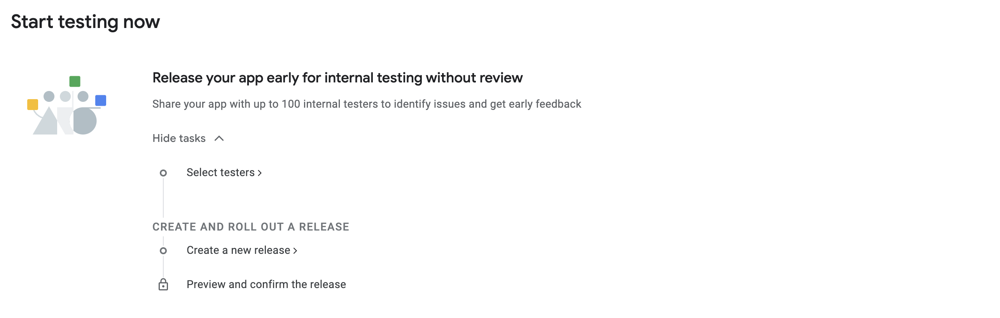
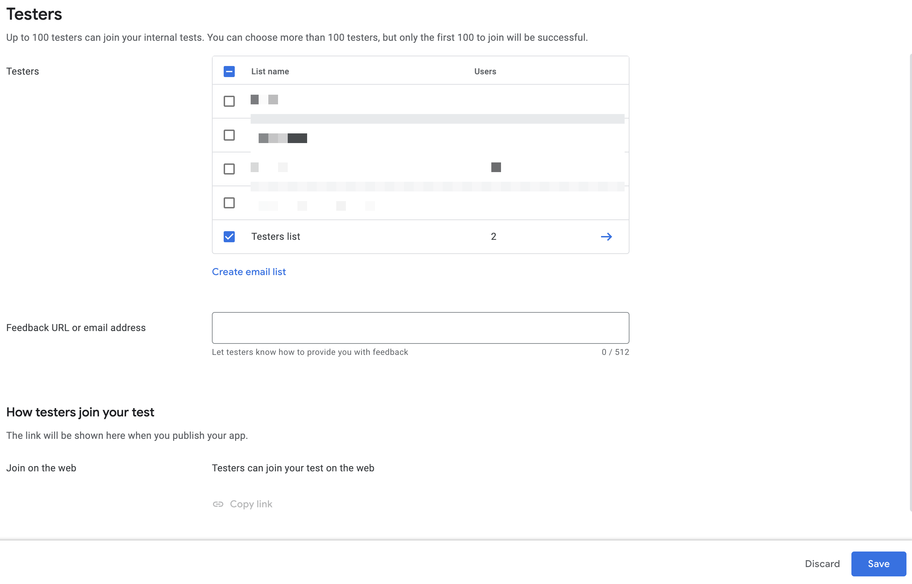

# First Submission of an Android App

If you are submitting your Android app to Google Play Store **for the first time**, Google requires you to upload it manually through Google Play Console &mdash; a web UI. This guide provides all the steps you need to follow to manually upload your app to Play Console and create your first release.

> [!NOTE]
> After you have submitted your app manually through Play Console, you will be able to use `eas submit -p android` for subsequent submissions.

> [!WARNING]
> Google Play Console dashboard gets updated, and keeping track of those changes is out of our scope. If you find something from this guide does not align with the Play Console, open an issue to let us know.

## Steps to create your first release

1. Open [Google Play Console](https://play.google.com/apps/publish/) and click **Create app**.

2. Enter **App name**, select **Default language**, **App or game**, **Free or paid**, and click **Create app**.

3. You will be redirected to the **Dashboard**, where you need to provide all the information about your Android app.

4. You will need to go through all the steps to fill out the app details. Start by preparing your app's internal testing version. Click **View tasks** under **Start testing now**.

> [!NOTE]
> This step is important. Otherwise, you will have some errors related to the app information when you want to publish your app.

5. You will be redirected to the **Internal testing** page. Under **Testers**, click **Create email list**, and provide a list of users to share the internal test release version of your app. After you have created the testers list, or selected a pre-existing one, click **Save**.

6. Click the **Create new release**.

7. You will be redirected to the App integrity screen. Select **Choose signing key** > **Google-generated key**. Using a Google-generated key will let you upload your app if you somehow lose your Android Keystore.

8. Under App bundles, click **Upload** and choose the **.aab** file from your computer to upload the archive. If you haven't created your build yet, [you can do this with `eas build`](https://docs.expo.dev/tutorial/eas/android-production-build/#create-a-production-build).

9. Once the upload completes, you will see the archive type and the **Version code**. The **Version code** is used to identify your app's releases. Each new release needs to have a unique **Version code**. If you are using the Expo, you can set this value in app config under `expo.android.versionCode` or learn how to automatically increment this value with [Remote version source](https://docs.expo.dev/build-reference/app-versions/).

10. Enter the Release name and click Next. You will be directed to **Preview and confirm** screen. You may see a warning about _"... no deobfuscation file associated with this App Bundle..."_. You can skip this for now, or if you are using Expo, [enable proguard rules using `expo-build-properties` library](https://docs.expo.dev/versions/latest/sdk/build-properties/#pluginconfigtypeandroid). Click **Save and publish**.

11. You will be redirected to the **Internal testing** > **Releases** summary page. You can click **Promote release** to make your app available to testers either internally or publicly (**Production**).

12. To share the release with the testers list created earlier, click **Testers** > **Copy link** to copy the link and share it manually. After a tester receives the link, they can install the app on their device.

## Next steps

To continue the release process, go back to the **Dashboard** and complete the remaining tasks under different sections for your app. You will need to provide information about your app's privacy policy, store assets, and other details. This is important to ensure that your app is ready for production.

### Further reading

- [Missing privacy policy](https://expo.fyi/missing-privacy-policy) error in Play Console
- [Create store assets](https://docs.expo.dev/guides/store-assets/) for your app's store page
- [Creating a Google Service Account key](https://expo.fyi/creating-google-service-account) is required to submit your app using EAS Submit (`eas submit -p android`)
- [Understanding app size](https://docs.expo.dev/distribution/app-size/)
