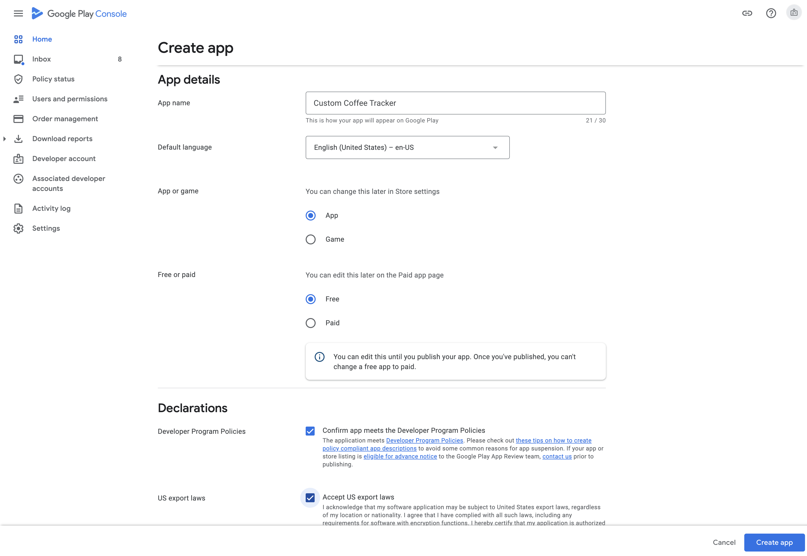

# First Submission of an Android App

#### 🤔 What Happened

If you're submitting your Android app to Google Play Store **for the first time**, Google requires that you manually upload it through their web user interface. After you have submitted it once through the web user interface, you will be able to use `expo upload:android` for subsequent submissions.

#### 💡 Solution

This page will guide you through creating an app in Google Play Console and uploading the first release.

1. Open [Google Play Console](https://play.google.com/apps/publish/).

2. Click the **CREATE APPLICATION** button. A modal will pop up.
3. Select **Default language**, fill in the **Title** input and click **CREATE**.

4. You'll be redirected to a new subpage where you can set **Product details**. **You don't need to set them now, come back and do this later.**

5. Go to the **App releases** tab and scroll to the **Internal test track** section. Click the **MANAGE** button.

6. Click the **CREATE RELEASE** button.

7. Opt in to app signing by Google Play. Although it's not necessary, this will let you upload your app if you somehow happen to lose your Android Keystore. Click the **CONTINUE** button.

8. Click **BROWSE FILES** and choose the `.apk` (or `.aab`) file from your computer to upload the archive.

9. Once the upload completes, you'll see the archive type along with the **Version code**. The **Version code** is used to identify your app's releases. Each new release needs to have a unique **Version code**. If you're using the Expo Managed Workflow you can set this value in `app.json` - `expo.android.versionCode`.

10. Scroll down and click **SAVE**.

11. You'll be redirected to the **Review summary** subpage. If you're using the Expo Managed Workflow you'll see the **Errors** section. Click **VIEW ERROR MESSAGE** to find out that you are required to have a privacy policy set. See another guide to learn how to do it - [expo.fyi/missing-privacy-policy](https://expo.fyi/missing-privacy-policy).

