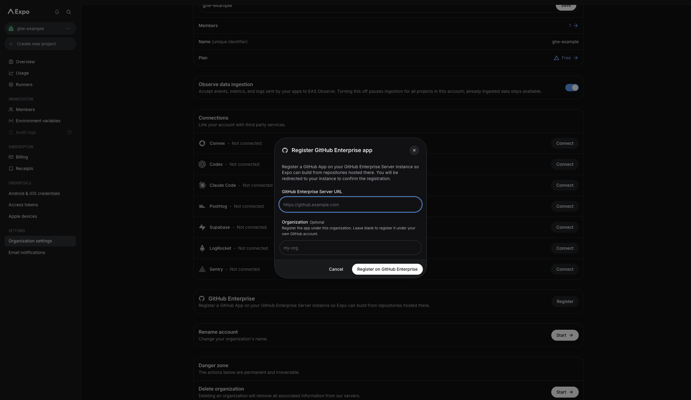
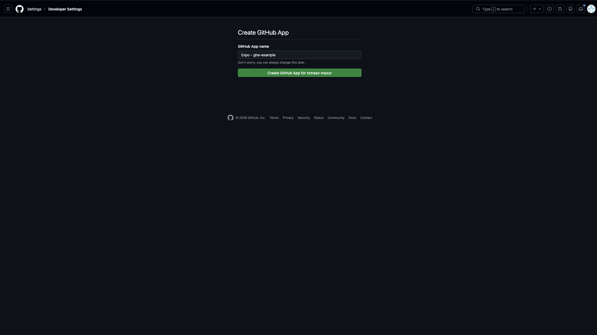
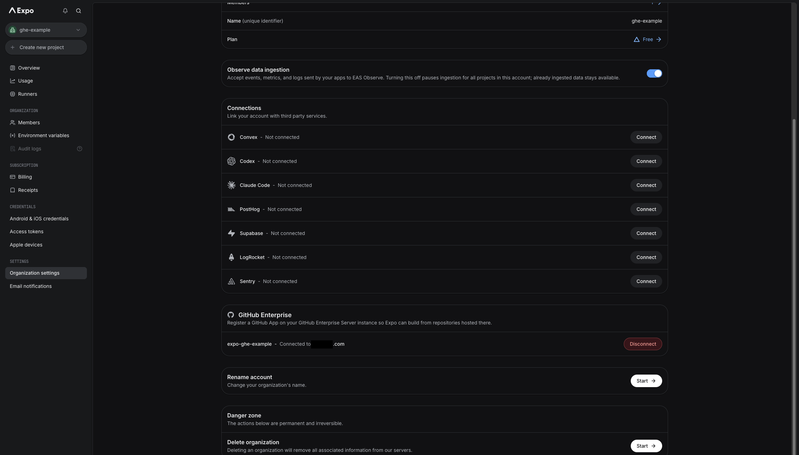
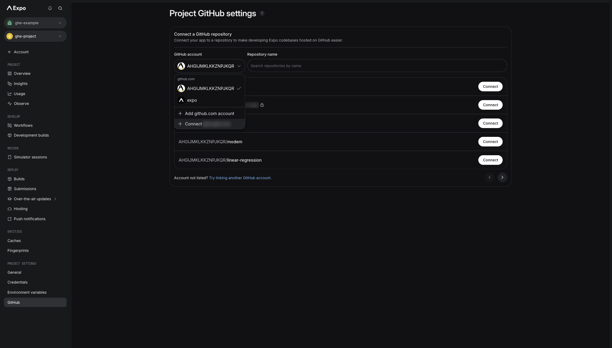
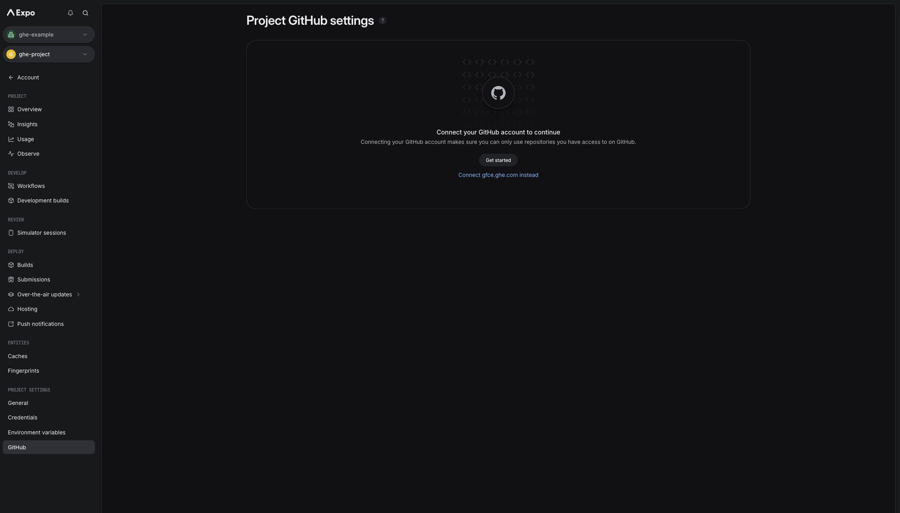
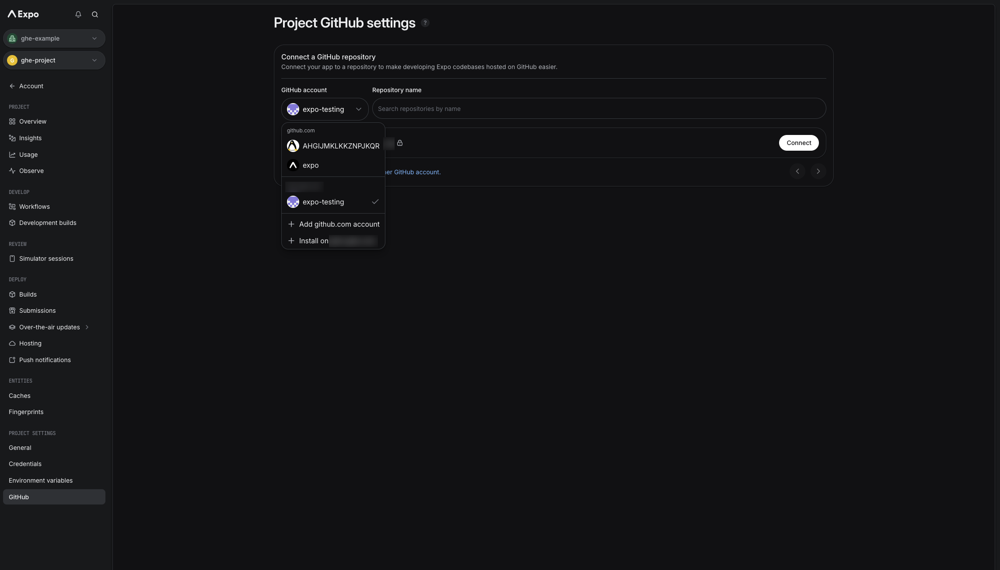

# GitHub Enterprise Server integration

To connect Expo projects to GitHub Enterprise Server repositories, you need to first connect your Expo account to a GitHub App on your GitHub Enterprise Server instance as described below.

1. Navigate to **Account Settings** on [expo.dev](https://expo.dev) and scroll to the **GitHub Enterprise** section. Click **Register**, enter the URL of your GitHub Enterprise Server instance and, optionally, the GitHub organization to register the app under. Leave the organization blank to register the app under your own GitHub account. Click **Register on GitHub Enterprise**.

2. You are redirected to your GitHub Enterprise Server instance. Confirm the app name and click **Create GitHub App**.

3. GitHub redirects you back to your account settings on Expo. The **GitHub Enterprise** section should show that the app is registered.

4. Navigate to **Project Settings > GitHub**. If a github.com account is already connected, open the **GitHub account** dropdown and select **Connect _your-instance_**.

If no GitHub account is connected yet, click **Connect _your-instance_ instead**.

5. Your GitHub Enterprise Server account should appear in the **GitHub account** dropdown, so you can now select a repository to connect.

