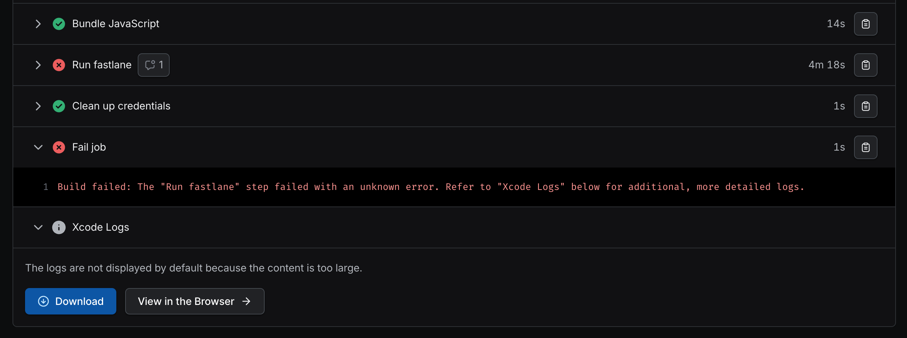

# iOS Bundle React Native code images Phase Fails

## Build Failure

Production iOS builds of the app can fail on one of the final steps with this error:

```
› Executing MyApp » Bundle React Native code and images
› Generating debug MyApp » MyApp.app.dSYM
    Run script build phase '[CP-User] [Hermes] Replace Hermes for the right configuration, if needed' will be run during every build because it does not specify any outputs. To address this issue, either add output dependencies to the script phase, or configure it to run in every build by unchecking "Based on dependency analysis" in the script phase. (in target 'hermes-engine' from project 'Pods')
    Run script build phase 'Upload Debug Symbols to Sentry' will be run during every build because it does not specify any outputs. To address this issue, either add output dependencies to the script phase, or configure it to run in every build by unchecking "Based on dependency analysis" in the script phase. (in target 'MyApp' from project 'MyApp')
    Run script build phase '[CP-User] Generate updates resources for expo-updates' will be run during every build because it does not specify any outputs. To address this issue, either add output dependencies to the script phase, or configure it to run in every build by unchecking "Based on dependency analysis" in the script phase. (in target 'EXUpdates' from project 'Pods')
▸ ** ARCHIVE FAILED **
▸ The following build commands failed:
▸ 	PhaseScriptExecution Bundle\ React\ Native\ code\ and\ images /Users/expo/Library/Developer/Xcode/DerivedData/MyApp-dyrgyyyqubtksffdzubncozohkfw/Build/Intermediates.noindex/ArchiveIntermediates/MyApp/IntermediateBuildFilesPath/MyApp.build/Release-iphoneos/MyApp.build/Script-00DD1BFF1BD5951E006B06BC.sh (in target 'MyApp' from project 'MyApp')
▸ 	Archiving workspace MyApp with scheme MyApp
▸ (2 failures)
** ARCHIVE FAILED **
The following build commands failed:
	PhaseScriptExecution Bundle\ React\ Native\ code\ and\ images /Users/expo/Library/Developer/Xcode/DerivedData/MyApp-dyrgyyyqubtksffdzubncozohkfw/Build/Intermediates.noindex/ArchiveIntermediates/MyApp/IntermediateBuildFilesPath/MyApp.build/Release-iphoneos/MyApp.build/Script-00DD1BFF1BD5951E006B06BC.sh (in target 'MyApp' from project 'MyApp')
	Archiving workspace MyApp with scheme MyApp
(2 failures)
Exit status: 65
```



## `appName` and `baseUrl` conflict

Download and view the full Xcode logs and if you find errors like: `Error: ENOTDIR: not a directory, mkdir`

```
+ /Users/expo/.nvm/versions/node/v20.18.3/bin/node /Users/expo/workingdir/build/node_modules/@expo/cli/build/bin/cli export:embed --entry-file /Users/expo/workingdir/build/node_modules/expo-router/entry.js --platform ios --dev false --reset-cache --bundle-output /Users/expo/Library/Developer/Xcode/DerivedData/MyApp-dyrgyyyqubtksffdzubncozohkfw/Build/Intermediates.noindex/ArchiveIntermediates/MyApp/BuildProductsPath/Release-iphoneos/main.jsbundle --assets-dest /Users/expo/Library/Developer/Xcode/DerivedData/MyApp-dyrgyyyqubtksffdzubncozohkfw/Build/Intermediates.noindex/ArchiveIntermediates/MyApp/BuildProductsPath/Release-iphoneos/MyApp.app --sourcemap-output /Users/expo/Library/Developer/Xcode/DerivedData/MyApp-dyrgyyyqubtksffdzubncozohkfw/Build/Intermediates.noindex/ArchiveIntermediates/MyApp/BuildProductsPath/Release-iphoneos/main.jsbundle.map --minify false --config-cmd ''\''/Users/expo/.nvm/versions/node/v20.18.3/bin/node'\''  '\''/Users/expo/workingdir/build/node_modules/react-native/cli.js'\'' config'
Experimental React 19 canary is enabled.
Fast resolver is enabled.
Starting Metro Bundler
iOS node_modules/expo-router/entry.js ░░░░░░░░░░░░░░░░  0.0% (0/1)
iOS Bundled 1812ms node_modules/expo-router/entry.js (2768 modules)
Writing bundle output to: /Users/expo/Library/Developer/Xcode/DerivedData/MyApp-dyrgyyyqubtksffdzubncozohkfw/Build/Intermediates.noindex/ArchiveIntermediates/MyApp/BuildProductsPath/Release-iphoneos/main.jsbundle
Writing sourcemap output to: /Users/expo/Library/Developer/Xcode/DerivedData/MyApp-dyrgyyyqubtksffdzubncozohkfw/Build/Intermediates.noindex/ArchiveIntermediates/MyApp/BuildProductsPath/Release-iphoneos/main.jsbundle.map
Copying 31 asset files
Error: ENOTDIR: not a directory, mkdir '/Users/expo/Library/Developer/Xcode/DerivedData/MyApp-dyrgyyyqubtksffdzubncozohkfw/Build/Intermediates.noindex/ArchiveIntermediates/MyApp/BuildProductsPath/Release-iphoneos/MyApp.app/myapp/assets/node_modules/@react-navigation/elements/lib/module/assets'
Error: ENOTDIR: not a directory, mkdir '/Users/expo/Library/Developer/Xcode/DerivedData/MyApp-dyrgyyyqubtksffdzubncozohkfw/Build/Intermediates.noindex/ArchiveIntermediates/MyApp/BuildProductsPath/Release-iphoneos/MyApp.app/myapp/assets/node_modules/@react-navigation/elements/lib/module/assets'
Command PhaseScriptExecution failed with a nonzero exit code
```

Then the issue is that your `appName`, "MyApp", conflicts with the experimental `baseUrl`, "myapp". If you "Show Package Contents" for `/Users/expo/Library/Developer/Xcode/DerivedData/MyApp-dyrgyyyqubtksffdzubncozohkfw/Build/Intermediates.noindex/ArchiveIntermediates/MyApp/BuildProductsPath/Release-iphoneos/MyApp.app` you would see an executable with the name: "MyApp".


If they are the same, then the OS cannot create a directory because a file of that name already exists, hence: `Error: ENOTDIR: not a directory, mkdir`.

## Workaround

Change your App Name or `baseUrl` to not be the same, whichever is most feasible for your setup.

## Things of note

- This issue is specific to the iOS build, Android my bundle the assets in a different location so there was no conflict as far as I know.
- This is not a bug with `eas`, doing the production build locally, via `xed ios`, and the build steps reproduces the issue.
- This is not a bug with `expo-cli` but maybe the `export:embed` script could be enhanced to handle potential `appName` and `baseUrl` clashes.
- This is not a bug with `@react-navigation/elements`. Any assets that are part of your app will be bundled, so this could be caused by any number of `node_modules` or other assets.
