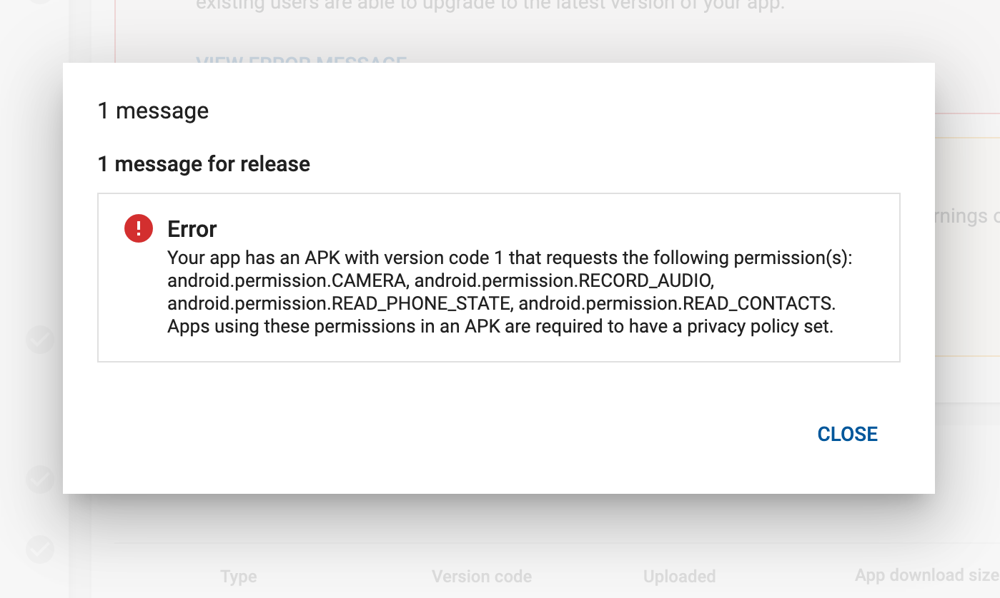
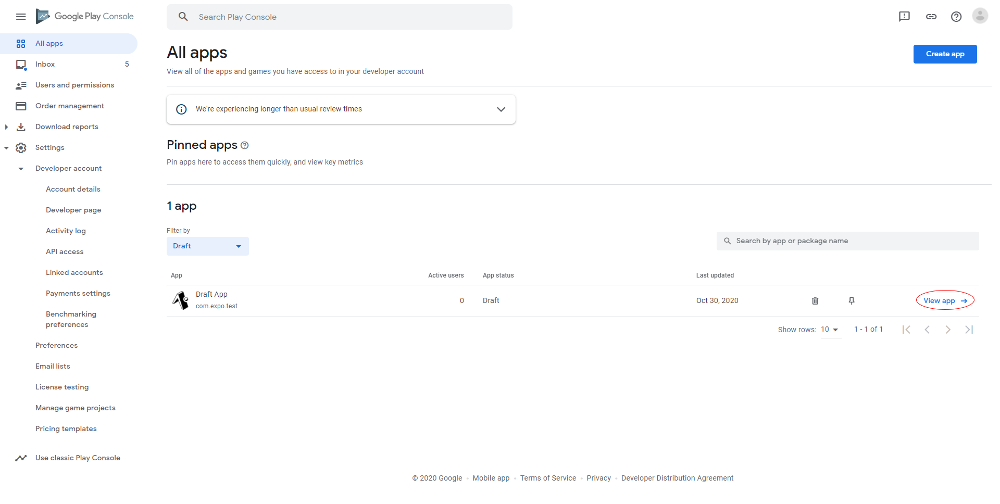
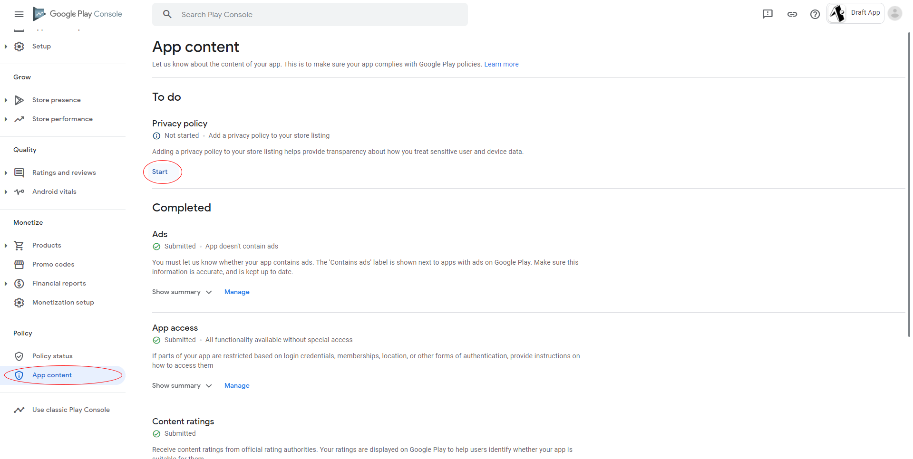
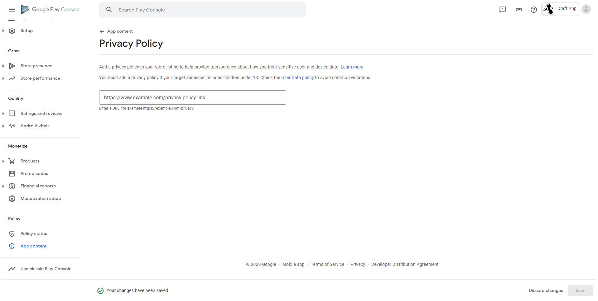
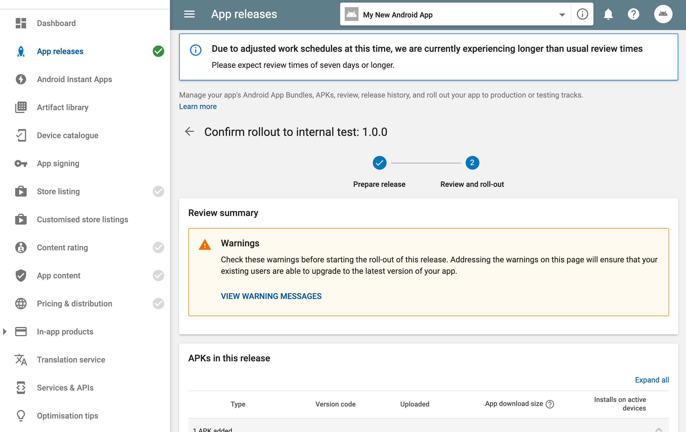

# Missing Privacy Policy

#### 🤔 What Happened

If you're submitting your Android app to Google Play Store using the `expo upload:android` command or Google Play console, you may encounter an error saying you need to have a privacy policy set for your app. It would look something like this on the Google Play Console:

If you were trying to submit your app with `expo upload:android` you may have seen the following error:

> The app has permissions that require a privacy policy set for the app.

#### 💡 Solution

This page will guide you through setting a privacy policy in Google Play Console.

1. Open [Google Play Console](https://play.google.com/apps/publish/), find your app on the list and enter the dashboard.

2. On the sidebar, choose **App content** and click the **Start** button in the **Privacy policy** section.

3. Fill in the **Privacy Policy** input and click **Save**.

4. Find your release in the **App releases** tab. Verify that no errors show up in the **Review summary** section.

