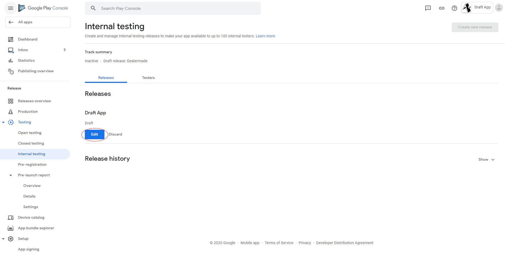
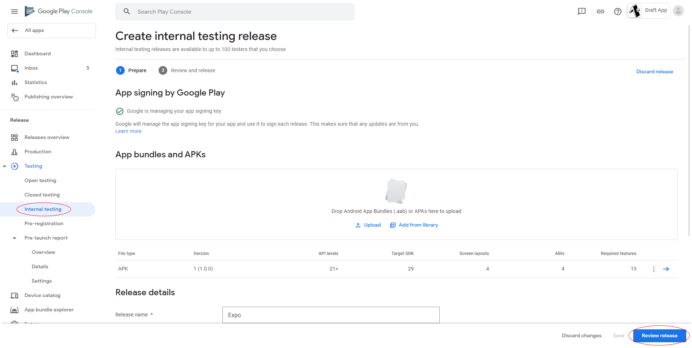
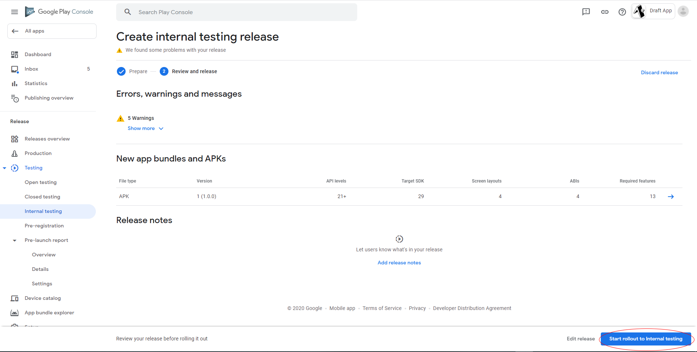

# Missing Privacy Policy

#### 🤔 What Happened

If you're submitting your Android app to Google Play Store using `expo upload:android`, `eas upload`, or the Google Play console, you may encounter an error saying you need to have a privacy policy set for your app. It would look something like this on the Google Play Console:

#### 💡 Solution

#### Set Privacy Policy in Google Play Console ...

This page will guide you through setting a privacy policy in Google Play Console.

1. Open [Google Play Console](https://play.google.com/apps/publish/), find your app on the list and click on `View app` to access to the dashboard.

2. On the sidebar, choose **App content** (which located at the bottom) and click the **Start** button in the **Privacy policy** section.

3. Fill in the **Privacy Policy** input and click **Save**.

4. Edit your release **App releases** tab.

5. Find your release in the **App releases** tab. Verify that no errors show up in the **Review summary** section.

#### ... or Customize App Permissions

If your app is not using the permissions that Google Play Store detects, you can customize them, rebuild the app and submit it again.
Learn more [how to customize permissions here](https://docs.expo.io/distribution/app-stores/#android-permissions).
