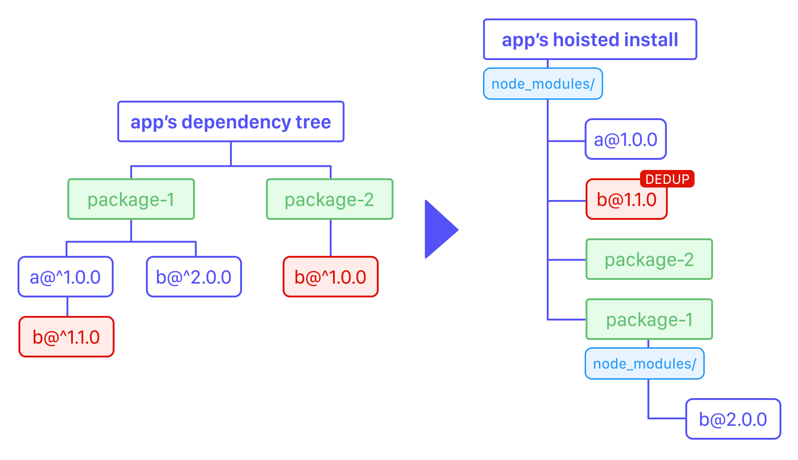

# Resolving Dependency Issues

> [!NOTE]
> If you've been linked to this page or already know that you have a dependency conflict, you can skip ahead to the ["How to resolve dependency issues" section](#how-to-resolve-dependency-issues).

Projects with outdated, misaligned, or duplicate dependencies can unexpectedly fail with build errors.
Common issues include but are not limited to:

- Dependencies like `react` and `react-native` rely on only one version being present in your app bundle.
- Tooling (including Expo tooling) expect certain version ranges of packages they depend on implicitly.
- Native modules cannot be duplicated in a native app (only one version compiles), but their JavaScript may be duplicated.

These problems typically lead to errors during native builds, bundling/exporting apps, or during runtime.

## Why dependency issues occur

There are **four common causes of dependency issues** you are most likely to encounter while using Expo:

1. Your app's dependencies have version ranges that are incompatible with the installed Expo SDK.
2. Your dependencies depend on incompatible versions of the same packages.
3. Your package manager has duplicated versions within your dependency tree or is in an unclean state.
4. You're in a monorepo with workspaces (Bun, npm, pnpm, or Yarn) and dependencies specify duplicate version ranges.

All problems relate to how semantic version ranges are specified in your dependencies or your dependencies' dependencies.
The npm documentation contains [an introduction guide](https://docs.npmjs.com/about-semantic-versioning) about [semantic versions](https://semver.org/).

### Semantic version ranges and hoisting

Every package's `package.json` contains a `version` with a major, minor, and patch number: `MAJOR.MINOR.PATCH`. Optionally, a label may be added to this version for prereleases.
Packages may define dependencies ([either on `dependencies`, `peerDependencies`, or `optionalDependencies`](https://docs.npmjs.com/cli/v11/configuring-npm/package-json#dependencies)).

Your and your dependencies define which version of a package is acceptable using [version range](https://github.com/npm/node-semver#versions). Package managers use this version range to decide which version of a package to install. There's a few version ranges that you'll commonly see, but here's a short (but incomplete) overview of some version range specifiers:

| Range | Description |
| -- | -- |
| `1.2.3` | Exactly `1.2.3` |
| `>=1.2.3` | A version greater than or equal `1.2.3` |
| `<1.2.3` | A version lower than `1.2.3` |
| `~1.2.3` | `v1.2.3` or a greater **patch** version |
| `^1.2.3` | `v1.2.3` or a greater **minor** version |
| `1.x.x` | Greatest version matching `x` for any number |
| `*` | Any version |

When installing multiple dependencies, package managers will deduplicate your dependencies by applying something called a **hoisting algorithm**.

[](./assets/resolving-dependency-issues/install-hoisting.png)

For example, as seen in the graphic above, the hoisting algorithm has three parts:
- if two packages are on compatible version ranges (`b@^1.1.0` and `b@^1.0.0`), a deduplicated version (`b@1.1.0`) can be installed if they share a common parent
- a deduplicated version can be shared and moved upwards ("hoisted") until either the root `node_modules` folder is reached, or a conflict occurs
- a conflict occurs, if a package has a conflicting version range (`b@^2.0.0` can't be shared with `b@^1.1.0`)

This explains how the **four common causes of dependency issues** occur. The dependency tree may contain multiple copies of packages if version ranges aren't compatible with one another.

_Hoisting_ is typically desirable, conflicts are expected, and it's been designed to work together with the [Node.js resolution algorithm](https://nodejs.org/api/modules.html#loading-from-node_modules-folders). When a package is resolved (`require` with CommonJS or `import` with ESM), resolution will look up a dependency in the current directory's `node_modules` folder, then in any `node_modules` folder in a parent directory.

### When hoisting leads to problems

Relating to the **four common causes of dependency issues**, having duplicate versions for a package installed isn't always desirable and may lead to issues. These are either **runtime issues** or **native linking issues**.

**Runtime issues** happen when a package has been written to act as a [singleton](https://en.wikipedia.org/wiki/Singleton_pattern). A package may contain state and values that aren't stored globally, but locally in the package. A common example is the `react` package. During runtime, your bundle may only contain a single `react` package, since it acts as an API layer that is compatible with multiple runtimes (`react-dom` and `react-native`).

**Native linking issues** happen because of [autolinking](https://docs.expo.dev/more/glossary-of-terms/#autolinking). [Expo Autolinking](https://docs.expo.dev/modules/autolinking/) will search for React Native and Expo modules in your dependencies and link them into your native build system. When compiling the native app, only one version of any native module can be present. However, this is in direct conflict with [normal Node.js resolution](https://nodejs.org/api/modules.html#loading-from-node_modules-folders), which can access duplicate versions of packages that contain native modules.

Both of these issues are related to your app's JavaScript bundle and runtime errors. Native modules typically don't expect to have multiple, different versions of their JavaScript code bundled into a single app.

---

## How to resolve dependency issues

### 1. Resolving Expo SDK incompatibilities

The Expo SDK contains different modules and tools that are designed to work together. As we release new versions of Expo packages, older versions may not work as intended with newer versions of the SDK. Similarly, sometimes a package from a newer SDK release isn't always compatible with older versions of the SDK.

The SDK version is determined using the version of the installed `expo` package. A limited set of dependency version ranges is tested against every SDK release and the [`expo install` command](https://docs.expo.dev/more/expo-cli/#install) will compare your dependencies against these known version ranges and report any misalignment.

```sh
# Check which installed packages need to be updated
npx expo install --check
# Automatically update any invalid package versions
npx expo install --fix
```

When running `expo install --fix`, the CLI will automatically attempt to realign your `dependencies` with the expected versions for your current Expo SDK version. This is a necessary step when upgrading between major SDK versions and `npx expo-doctor` will also tell you when to run this command.

### 2. Deduplicating top-level dependencies

Your app's `package.json` may specify `dependencies` that are also installed by nested dependencies. You will not see a duplicate installation of a native module in your own `package.json` but it may be inside of your dependencies' dependencies.

For example, consider an example where you've installed `react-native-example-module@3.16.0` (an exact version), but a dependency depends on `react-native-example-module@^3.17.0`. Both ranges are incompatible, since you want to install `3.16.0` but the transitive dependency wants `3.17.x`. This means two versions of the native module are installed at the same time, two versions of the dependency's JavaScript code will be bundled, but only one native module will be linked into your native app.

```sh
example
└── react-native-example-module 3.17.0
react-native-example-module 3.16.0
```

You can check whether a dependency has duplicates by using the `why` subcommand of your package manager. The exact command will differ depending on which package manager you use.

```sh
# For Bun:
bun pm why react-native
# For npm:
npm why react-native
# For pnpm:
pnpm why --depth=10 react-native
# For Yarn:
yarn why react-native
```

The outputs from all package managers will differ. You're looking for duplicate entries that:
- have two or more different exact versions (`MAJOR.MINOR.PATCH` without the version range syntax)
- aren't indicated as having been hoisted or deduplicated

Once you've identified a duplicate for one of your top-level dependencies, change their version in your `package.json` to either match a range that includes all versions you've found, or match the lowest version that is compatible with the dependency versions you've found. Afterwards, reinstall your dependencies and check whether the duplicate has disappeared.

> [!TIP]
> From SDK 54, `expo-doctor` will automatically check for duplicate native modules by using Expo Autolinking's output.

### 3. Deduplicating transitive dependencies in your lockfile

Sometimes even after doing both of these steps, your app will still contain duplicate native modules. This is often due to **transitive** dependencies. These are your dependencies' dependencies and since you may not directly depend on these in your `package.json`, you may not be aware of all of them. Some of these transitive dependencies may also be native modules that shouldn't be duplicated.

Usually, these duplications are only visible in your package manager's lockfile and they either disappear or appear as you update your packages (meaning, their versions are bumped within their current version ranges), or when you upgrade packages (Note: This problem is somewhat more common with [Yarn v1 (Classic)](https://classic.yarnpkg.com/lang/en/) which doesn't deduplicate packages as actively as other package managers.)

When running into transitive duplicates, this doesn't mean that your lockfile is broken or that you must delete it, and sometimes deleting it may not help due to your package manager's caches.
Package managers have commands that can automatically deduplicate transitive dependencies, which is the most reliable way to align your dependencies:

```sh
# For npm:
npm dedupe
# For pnpm:
pnpm dedupe
# For Yarn Berry:
yarn dedupe
# For Yarn v1 (Classic)
npx yarn-deduplicate && yarn
```

> [!NOTE]
> Bun currently [does not yet have official support for deduplicating dependencies](https://github.com/oven-sh/bun/issues/8594#issuecomment-2195796840).
> However, deleting your Bun lockfile will typically achieve deduplication reliably.

You can observe the changes by `git diff`-ing your lockfile afterwards. You'll likely also see non-native modules being deduplicated. It's best practice to keep track of updating your dependencies regularly, as much as you would upgrade your top-level dependencies.

```sh
# For npm:
npm update
# For pnpm:
pnpm update
# For Yarn Berry:
yarn up
# For Yarn v1 (Classic)
yarn upgrade
```

You can pass specific package names to these commands as well, if you need to selectively update packages.

### 4. Overriding conflicting dependencies

Lastly, some of your packages or dependencies may have conflicting `dependencies` or `peerDependencies` that you cannot resolve. For example, one package may specify an outdated peer dependency range for `react@^18.0.0`, while Expo requires `react@^19.0.0`. The same can happen with regular dependencies, and both JavaScript-only packages or native modules. This is even more common in monorepos that contain multiple apps.

First, check if the affected packages can support and run with a newer (or older) version of the conflicting dependency. If they can, you can resolve this by forcing your package manager to install a specific version of the package. This is done by adding a resolution to your `package.json`:

```json
{
  "name": "my-project",
  "version": "0.0.0",
  // ...
  "resolutions": {
    "react": "^19.1.0"
  }
}
```

For npm, you have to use a property named `overrides` rather than `resolutions`, but it's otherwise the same:


```json
{
  "overrides": {
    "react": "^19.1.0"
  }
}
```

Reinstall your dependencies after adding your resolutions.

This will instruct your package manager to **always** use the specified version of this package (`react` in the example) rather than any other version ranges it finds. This will always deduplicate a package. Make sure you don't keep a resolution around for any longer than it's needed, as it can cause incompatibilities when you upgrade in the future!

## When dependency issues commonly happen

Dependency issues and conflicts don't happen randomly, but may happen whenever your dependencies or transitive dependencies change.
- A newly added package may cause a conflict
- An updated package may cause a duplicate in your lockfile
- A downgraded or removed package may lead to conflicts with some package managers
- Upgrading the SDK or updating many dependencies at the same time may lead to duplicates

In short, dependency issues may happen whenever your dependencies change. But we have three tips to make them less likely!

### 1. Use `expo install` for native modules

The [`expo install` command](https://docs.expo.dev/more/expo-cli/#install) doesn't only check your existing dependencies, it can also be used to install new native modules.

When you're installing a new native module, try using `npx expo install <pkg>` instead of using your package manager directly. `expo install` will automatically check whether it knows about the native module you're trying to install, and, if it does, it aligns the version to a supported range.

```sh
# For example, instead of this:
yarn add expo-audio
# USE THIS INSTEAD:
expo install expo-audio
```

### 2. Be aware of (auto-installing) peer dependencies

When packages contain packages inside of `peerDependencies`, they're specifying a compatible range for them that they support. Your package manager will tell you if you're trying to install an incompatible package, based on that package's peer dependency version ranges.

For example, for Yarn, you'll see a warning, but it won't stop you from installing with an invalid peer version range:

```sh
warning " > react-example-package@1.2.3" has incorrect peer dependency "react@^18".
```

While, for npm, you'll see an error, and it will actively stop you from continuing:

```sh
npm error Could not resolve dependency:
npm error peer react@"^18" from react-example-package@1.2.3
```

However, you should be aware that, by default, in npm, pnpm, and Bun, **peer dependencies may install automatically** if they were previously not installed by you directly.
This can, in rare cases, lead to unintentional conflicts if that package manager doesn't also verify that the auto-installed peer dependency isn't already a transitive dependency or installs it twice.

<details>
<summary><strong>Disabling auto-installing peer dependencies for npm</strong></summary>

To disable automatically installed peer dependencies for npm, create a `.npmrc` file in your project with this configuration option:


```
legacy-peer-deps=true
```

</details>

<details>
<summary><strong>Disabling auto-installing peer dependencies for pnpm</strong></summary>

To disable automatically installed peer dependencies for pnpm, create a `pnpm-workspace.yaml` file in your project with this configuration option:

```yaml
autoInstallPeers: false
```

</details>

<details>
<summary><strong>Disabling auto-installing peer dependencies for Bun</strong></summary>

To disable automatically installed peer dependencies for Bun, add `peer = false` to the `[install]` section of your `bunfig.toml` file in your project:

```toml
[install]
peer = false
```

</details>

### 3. Run Expo Doctor after upgrading

When upgrading your Expo SDK version (no matter if it's an update or a new major release), or after upgrading native modules, or after upgrading dependencies, please run Expo Doctor to quickly check whether your project's dependencies are still in a clean state.

```sh
npx expo-doctor@latest
```

This will also tell you whether to run `npx expo install --fix` and is the quickest way to detect project issues.
