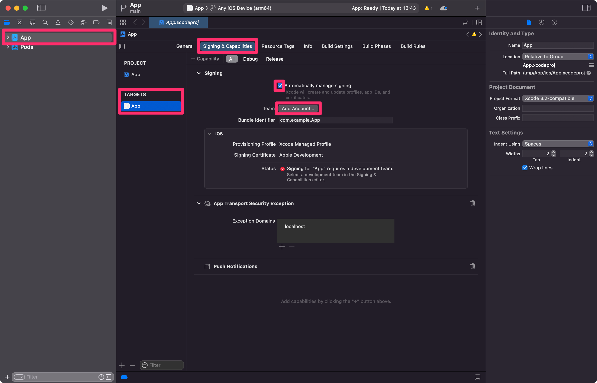
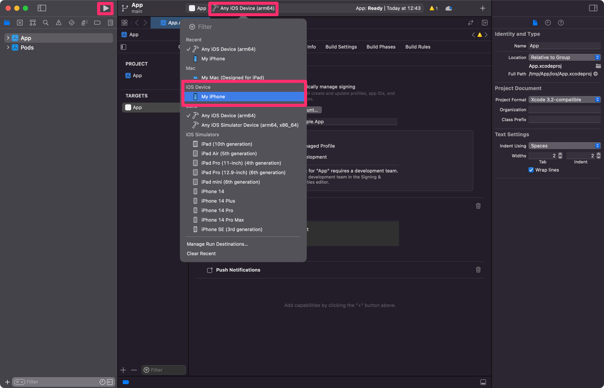

# Setup Code Signing Certificates in Xcode for Development

In order to build an iOS app with custom entitlements, you'll need to setup _code signing certificates_ which Apple uses to track all of the software installed on iOS devices. This means you'll need to connect your Apple developer account to Xcode, Xcode can use this to automatically create an _iOS Development Certificate_ and _Provisioning Profile_ for your project.

> 💡 Certificates are saved to your local Keychain so you don't need to set them up often.

1. Open your iOS project in Xcode by running `xed ios` or `open ios/<yourproject>.xcworkspace` in your Terminal. If your Expo project doesn't have an `ios` folder, run `npx expo prebuild -p ios` to generate one locally.
2. Select the first project in the **navigator** then the target with the matching native in the "project and targets list".
3. Select "Signing & Capabilities", ensure you have "Automatically manage signing" selected.
4. Ensure a "Development Team" is selected, this may require that you sign-in to your Apple Developer account.
   1. Press the "Add Account" button next to the team label. Follow the sign in flow.

   

5. Select a physical device from the dropdown at the top-center of the UI. Xcode will add this device to your account.
6. Build the app onto your device by pressing the "Play" symbol at the top-left of the the UI.

   

   1. You may need to "trust" the device you just added to the Xcode "Development Certificate", this is done in your iOS device in: Settings > General > Device Management > [your new certificate] > Trust.
      Learn more: [Apple docs (MaintainingCertificates)](https://developer.apple.com/library/content/documentation/IDEs/Conceptual/AppDistributionGuide/MaintainingCertificates/MaintainingCertificates.html).
   2. You may need to enable Developer Mode for your device. This is done in your iOS device in: Settings > Privacy > Developer Mode.
      If the Developer Mode option doesn't appear, you might need to unplug your iOS device from your computer.
      Learn more: [Apple docs (Enabling Developer Mode)](hhttps://developer.apple.com/documentation/xcode/enabling-developer-mode-on-a-device).

7. Now you can return to Expo CLI and build your project locally with `npx expo run:ios`. The process above only needs to be done once per computer / account, you don't need to do this for every new native project.

> Simulators require code signing when certain entitlements are enabled, e.g. Associated Domains.
