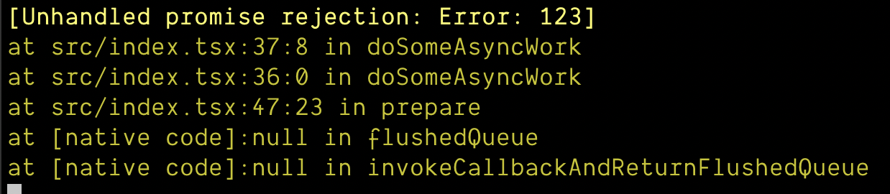

# Stuck on the Splash Screen?

It can be frustrating to work on your app when you can't even get it to load past the splash screen. Here are a couple of possible reasons why you might be seeing this with your app:

### 1. You may have forgotten to call `SplashScreen.hideAsync()`

If you call `SplashScreen.preventAutoHideAsync()` to do some work while the splash screen is displayed (for example, to preload extra data and assets while your app starts up), you need to ensure that you always end up calling `SplashScreen.hideAsync()`. It's possible that you forgot to call this method!

### 2. An error may have prevented `SplashScreen.hideAsync()` from being called

Let's say you structure your code like this:

```js
async function loadResourcesAsync() {
  await loadStoredDataAsync();
  await loadFontsAsync();
  SplashScreen.hideAsync();
}
```

If either `await loadStoredDataAsync()` or `await loadFontsAsync()` throw an exception, you will never reach the `SplashScreen.hideAsync()` call.

In other words, if you have an unresolved promise or anything that will prevent `hideAsync()` from being called, then you'll be stuck on the splash screen indefinitely. Often, you can verify what is going wrong by checking the terminal logs: 




### Still stuck?

Refer to the ["Manual debugging" guide](https://expo.fyi/manual-debugging) to learn more about how you can go about narrowing down the root cause of the problem in your unique circumstances.


