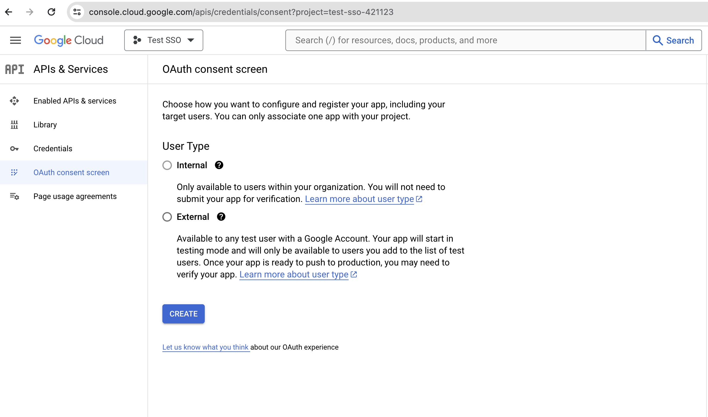
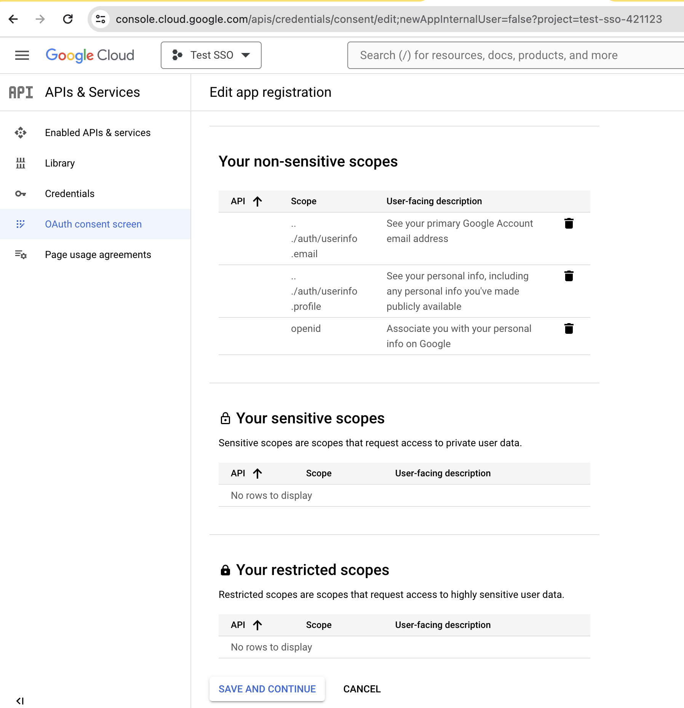
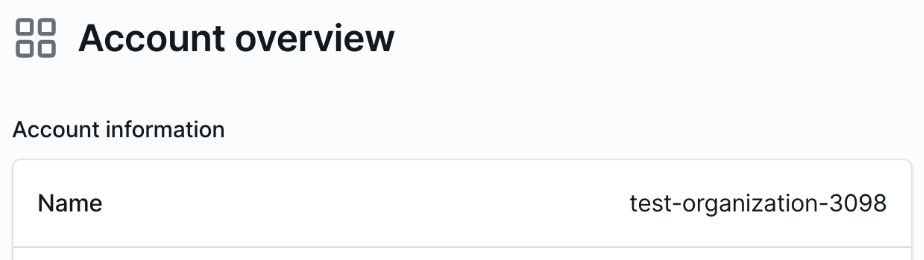

# Configuring Google WS for Expo SSO

In order for Expo to configure your organization to use Single Sign-On (SSO),
it is recommended that you create and configure a new Google Cloud Project in your Google Workspace and make note of the following information:

- Client ID from your Google WS application
- Client secret from Google WS application
- Google issuer URL is https://accounts.google.com
- Expo organization name

A user with Owner permission can enter this information in your Expo org's settings to turn on SSO.

Read on for how to configure the Google WS application and obtain this information.

## Setting up the Google WS application

1. In the Google WS admin interface, **Select your project** that you have created in the dropdown list at the top to the right of **Google Cloud**:

2. Select **Apis & Services** -> **OAuth consent screen** from the navigation menu on the left:

3. Select a **User Type** and click **Create**.

4. Enter required application information:
- Name your app, e.g. `Expo`
- Enter a user support email

5. Scroll down, click **+ ADD DOMAIN** and enter your pre-registered authorized domain, then enter your developer contact email and click **SAVE AND CONTINUE**.

6. In the Scopes configuration screen click on **ADD OR REMOVE SCOPES**.

7. Select scopes, normally the ones you need are at the top and have an empty API field:
- ./auth/userinfo/email
- openid
- ./auth/userinfo/profile

Then click **UPDATE**.

8. The selected scopes should then be displayed under **Your non-sensitive scopes**.
Click **SAVE AND CONTINUE**.

9. Depending on the User Type selected in step 3, you may have the option to add test users.

10. To create credentials, click on **API's & Services** -> **Credentials** in the navigation menu on the left, and then click on **+ CREATE CREDENTIALS** at the top.

11. Select **OAuth client ID**:

12. Select Application type **Web application**.

13. Complete the OAuth client configuration:

- Give the application a name, e.g.`Expo`.
- Set **Authorized JavaScript origins** to: `https://expo.dev`
- Set **Authorized redirect URIs** to: `https://expo.dev/auth/callback/googlews`

Click **CREATE** to generate the client id and client secret.

## Providing application info to Expo

After saving the credentials, Google will take you to the **Credentials** page, where you can select your client and view and copy information that will be needed by the Expo team in order to configure SSO on your Expo organization.

Expo will need:
- Client ID
- Client secret
- Issuer URL
- Expo organization name

### Obtaining Client ID / Secret / Issuer URL

1. Obtain client ID and secret by clicking on **APIs & Services** in the navigation menu on the left and then selecting **Credentials**.

Select your OAuth client to view your credentials on the right under **Additional Information**:

2. The Google issuer URL is `https://accounts.google.com`

### Obtaining Expo organization name

The Expo organization name is available from the Account overview when logging into your account at [expo.dev](https://expo.dev):

