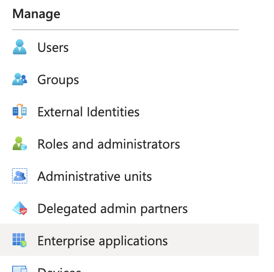

# Configuring Microsoft Entra ID for Expo SSO

In order for Expo to configure your organization to use Single Sign-On (SSO), you will need to configure a new application in Microsoft Entra ID and then provide the Expo support team with the following information:

- Client ID from your application
- Client secret from application
- Tenant ID
- Expo organization name

Read on for how to configure the Entra ID application and obtain this information.

## Setting up the Entra ID application

### Creating a new application

1. In the [Azure portal](ttps://portal.azure.com/#home), go to **App Registrations** and choose **New Registration**:

2. For the new registration, give it a name and set it to "single tenant." Click **Register**:

3. Go back to the list of **App Registrations** and click your new registration. Click **Authentication**, **Add a platform**, and **Web**:

4. Set the **Redirect URI** to `https://expo.dev/auth/callback/msentraid` and click **Configure**:

5. Click **Add URI** and add `https://expo.dev`. Then click **Save**:

### Granting permissions

6. Click **API Permissions** on the sidebar and then **Add Permission**:

7. Click **Microsoft Graph**, **Delegated Permissions**, select the four OpenID permissions (email, offline_access, openid, profile), and then click **Add Permissions**:

### Set an owner

8. Click **Owners** on the sidebar, **Add owners**, and add an owner:

### Create a client secret

9. Click **Overview** on the sidebar and then **Add a certificate or secret**:

10. Click **New client secret**, set a description, and create the secret:

Copy this secret, as it will only be available for a limited time.

### Assigning users to the OIDC app

11. Go to Azure home, then to **Microsoft Entra ID**, and click on the Expo OIDC application:

12. Click **Assign users and groups**, then **Add User/Group**, then **None Selected**, and then select all applicable users:

### Important: SSO users must have email addresses

In order to login successfully to Expo with SSO, users must have an email address set. You can check this by going back to the Azure home, then to **Microsoft Entra ID**, **Users**, and then open up a user and look at their **Properties** tab.

## Providing application info to Expo

To setup your account to use MS Entra ID, Expo will need:
- Client ID from your application
- Client secret from application
- Tenant ID
- Expo organization name

### Obtaining Client ID / Tenant ID

Client ID will be available under **Home** -> **App registrations** -> your new app:

### Obtaining Client Secret

If you didn't copy it when creating it, for a limited time, client secret will be available next to the Client and Tenant ID's, under **Client Credentials**. If the secret is no longer visible, you can create a new one:

### Obtaining Expo organization name

The Expo organization name is available from the Account overview when logging into your account at [expo.dev](https://expo.dev):

