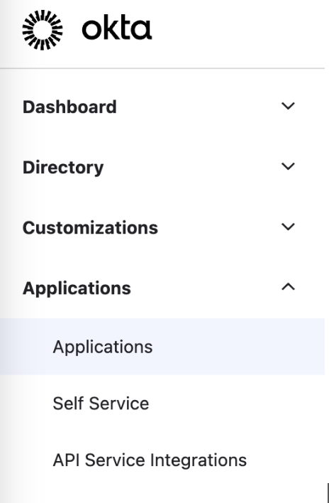
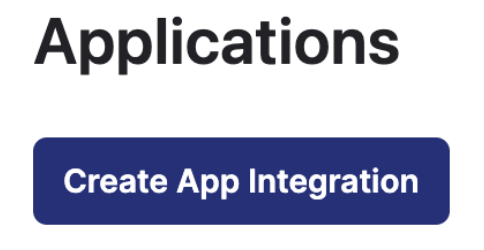
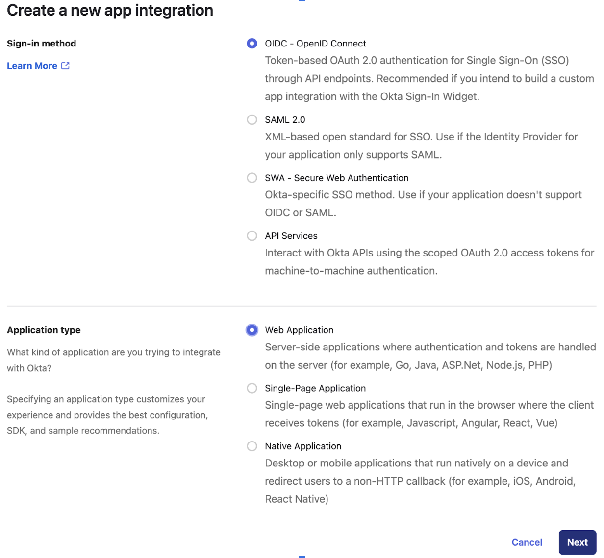
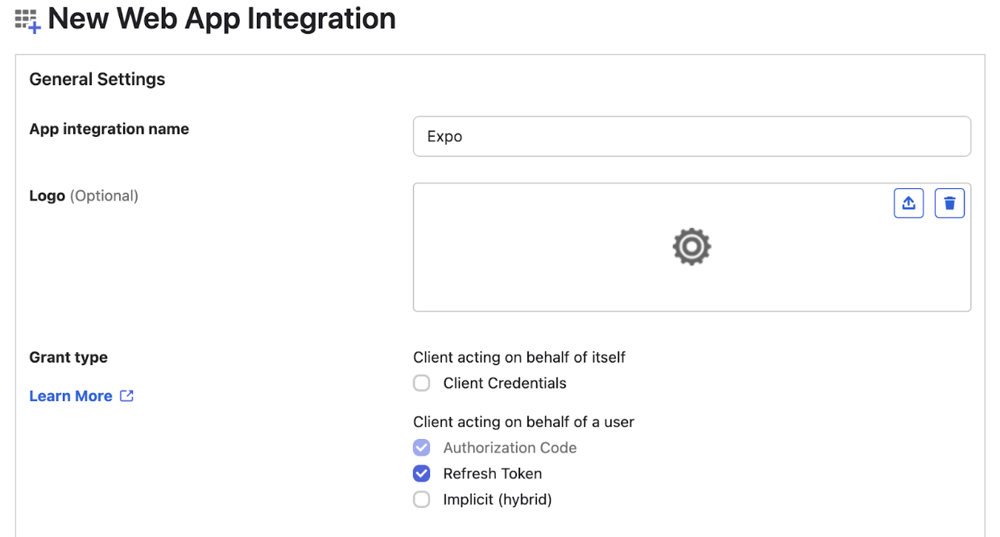
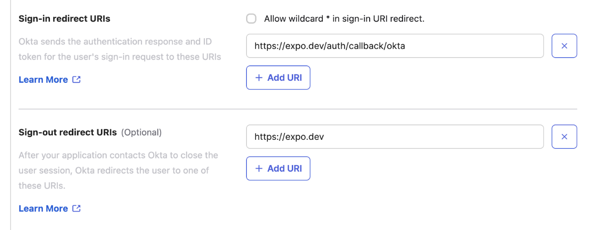
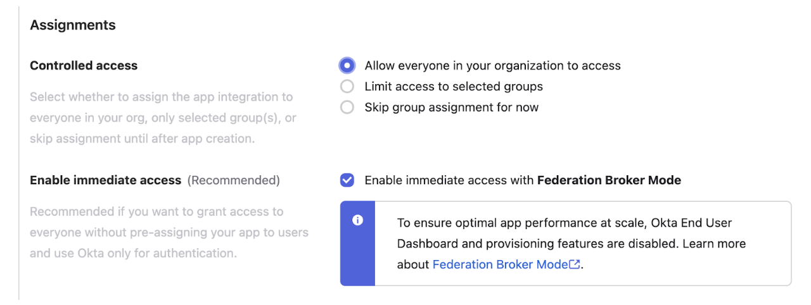
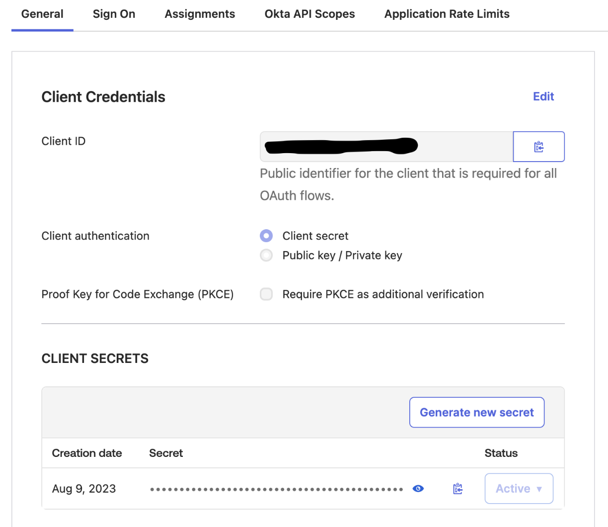
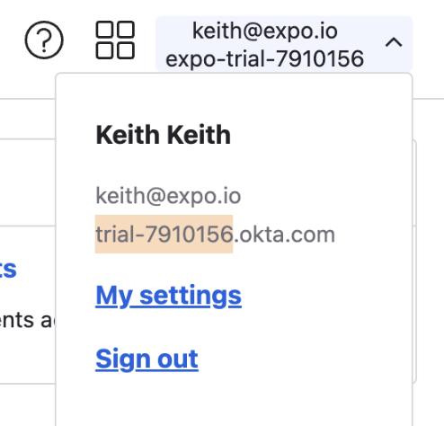

# Configuring Okta for Expo SSO

In order for Expo to configure your organization to use Single Sign-On (SSO), you will need to configure a new application in Okta and then provide the Expo support team with the following information:

- Client ID from your Okta application
- Client secret from Okta application
- Okta subdomain
- Expo organization name

Read on for how to configure the Okta application and obtain this information.

## Setting up the Okta application

1. In the Okta admin interface, select **Applications** -> **Applications** in the menu on the left:

2. Then click **Create App Integration**:

3. Choose **OIDC** and **Web Application**:

4. Name the app `Expo`` and select the **Authorization Code** and **Refresh Token** options:

5. Set the **Sign-in Redirect URI** to `https://expo.dev/auth/callback/okta` to and the **Sign-out URI** to `https://expo.dev`:

6. Set the **Assignments** settings in a manner consistent with how your Okta organization is configured:

## Providing application info to Expo

After saving the application, Okta will take you to the application screen, where you can copy information that will be needed by the Expo team in order to configure SSO on your Expo organization.

Expo will need:
- Client ID
- Client secret
- Okta subdomain
- Expo organization name

### Obtaining Client ID / Secret / Issuer URL

1. Obtain client ID and secret from the **General** tab under the application::

2. Obtain the subdomain from the user settings in the upper right corner:

### Obtaining Expo organization name

The Expo organization name is available from the Account overview when logging into your account at [expo.dev](https://expo.dev):

