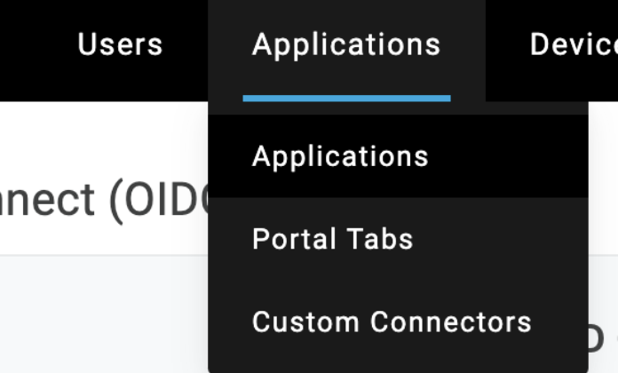
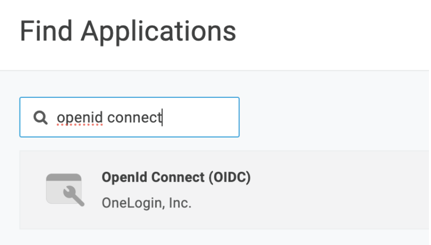
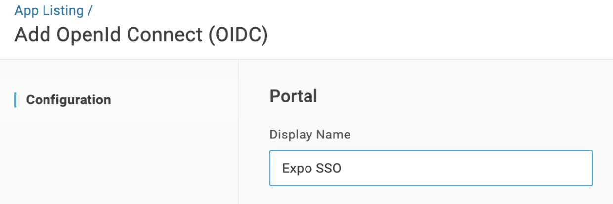
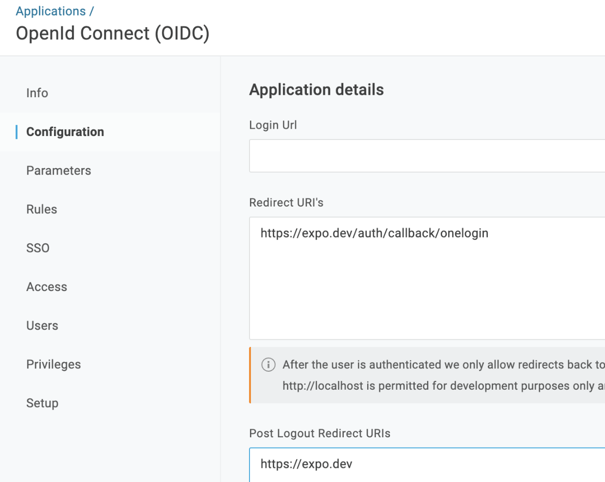
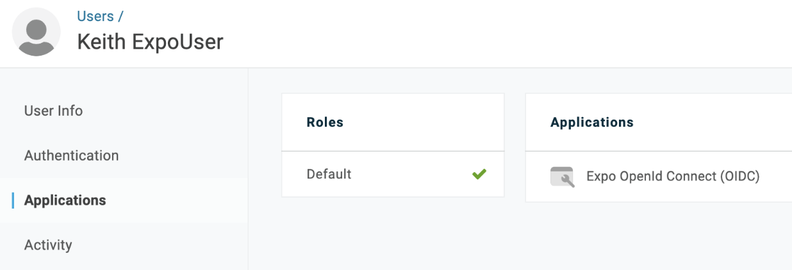
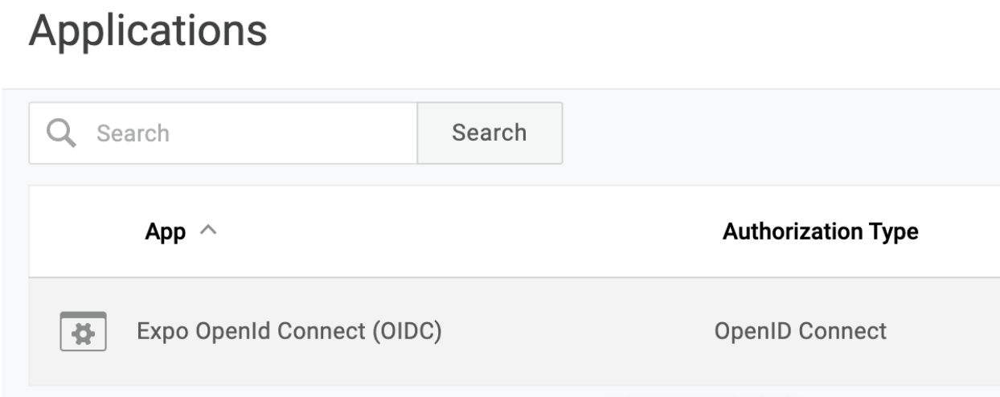
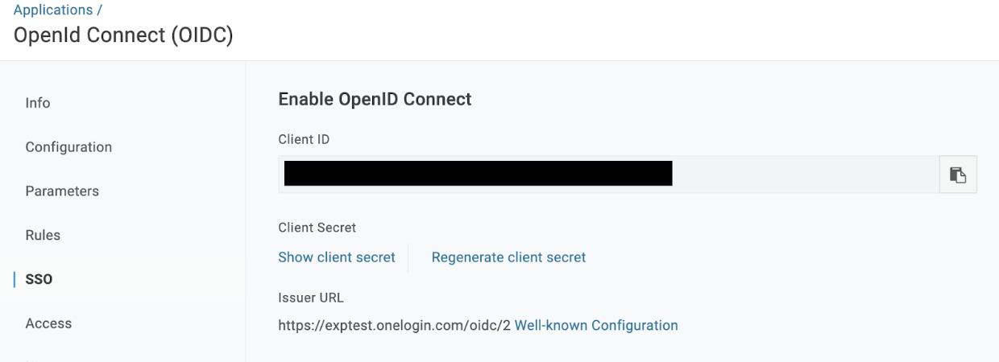
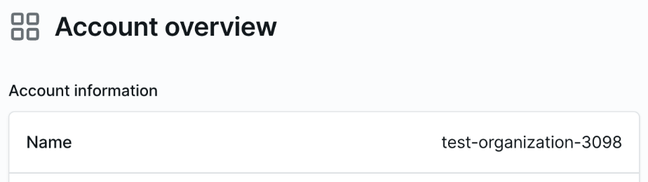

# Configuring OneLogin for Expo SSO

In order for Expo to configure your organization to use Single Sign-On (SSO), you will need to configure a new application in OneLogin and make note of the following information:

- Client ID from your OneLogin application
- Client secret from OneLogin application
- OneLogin issuer URL
- Expo organization name

Read on for how to configure the OneLogin application and obtain this information.

## Setting up the OneLogin application

1. In the OneLogin administration dashboard, select **Applications** -> **Applications** in the top menu:

2. Click **Add App**:

3. Find and choose “**OpenId Connect (OIDC)**”:

4. Give your app a display name and click **Save**:

5. Go to the Configuration tab, set **Redirect URI’s** to `https://expo.dev/auth/callback/onelogin` and the **Post Logout Redirect URI’s** to `https://expo.dev`:

## Ensuring users can login from the new application

Depending on how your OneLogin org is configured, you may need to add the application you just created to users’ accounts.

To check this, you can go to the **Users** menu, choose **Users**, and click on a specific user. Click on **Applications**, and check if the user has the application you just created added:

## Providing application info to Expo

Inside your Application on the OneLogin administration dashboard, you can find and copy the information that will be needed by the Expo team in order to configure SSO on your Expo organization.

Expo will need:
- Client ID
- Client secret
- Issuer URL
- Expo organization name

### Obtaining Client ID / Secret / Issuer URL

1. Go to the **Applications menu**, and click on **Applications**:

2. Click on your OIDC application:

3. Click on the **SSO** tab, and all of these fields will be to the right:

### Obtaining Expo organization name

The Expo organization name is available from the Account overview when logging into your account at [expo.dev](https://expo.dev):

